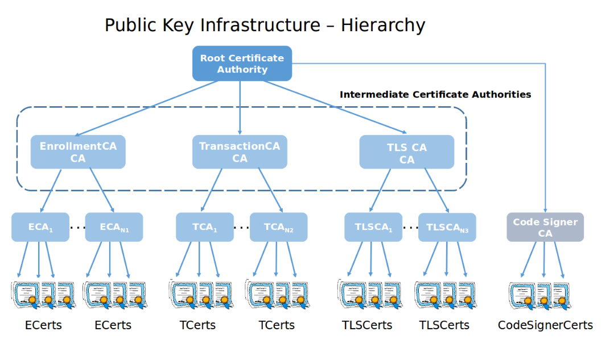
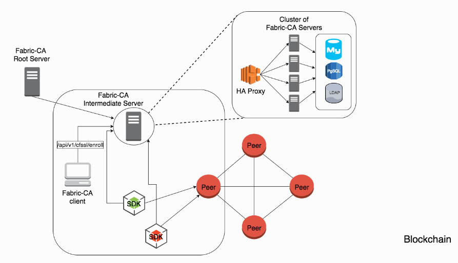

# 1 简介

在[一步一步搭建hyperledger环境](./build_fabric_network_step_by_step.md)和[kafka共识的orderer集群fabric网络环境搭建](./build_fabric_network_with_kafka_orders.md)两个例子中，我们都只使用`cryptogen`这个命令行工具来生成各个组织的证书和公私钥文件，在实际生产环境中，我们应当为每个组织建立单独的CA服务器，为这个组织提供PKI体系管理，如图所示：。



- enrollment certificate：用户身份证书，作为在网络中确认用户身份使用，长期证书。
- transaction certificate：交易证书(目前暂未实现)，每个交易生成的短期证书。
- tls certificate：tls通信使用的证书，节点之间建立https安全连接时使用。长期证书。

在网络拓扑中，`fabric ca`的工作方式如下图所示：



fabric ca client、fabric sdk通过REST API与`fabric ca`交互。大规模情况下，可以用ca形成集群，在集群中存在一个ca根服务器，和若干中间ca服务器，所有ca服务通过haproxy实现负载均衡，共享相同的存储数据库或者LDAP配置。而fabric ca client和fabric sdk都是通过haproxy来与ca集群交互的。

# 2 fabric ca的集成场景

> 集成验证环境使用1.1版本进行验证

## 2.1 使用fabric-ca管理所有证书


## 2.2 使用fabric-ca结合用户提供根证书


## 2.3 使用cryptogen生成的根证书

参考网络资料[Fabric CA环境的集成](http://www.cnblogs.com/studyzy/p/7482451.html)进行操作验证。

#4 总结

以上为通过fabric ca管理组织中用户的简单测试。更多细节可参考官方[用户指南](http://hyperledger-fabric-ca.readthedocs.io/en/latest/users-guide.html#)。

#附录

## fabric-ca-server-config.yaml配置说明

```yaml
#ca-server监听的端口
port: 7054

#开启debug日志
debug: false

#############################################################################
#  是否启用https以及https使用的证书和私钥
#############################################################################
tls:
  # Enable TLS (default: false)
  enabled: false
  certfile: ca-cert.pem
  keyfile: ca-key.pem

#############################################################################
#  签发证书使用的ca证书和公私钥。可用于签发用户注册证书和事务交易证书。
#############################################################################
ca:
  # Certificate file (default: ca-cert.pem)
  certfile: ca-cert.pem
  # Key file (default: ca-key.pem)
  keyfile: ca-key.pem

#############################################################################
#  控制注册用户生成证书逻辑。使用ldap时，此部分配置被忽略
#  Roles：默认管理元的角色；DelegateRoles：管理员可代理的角色
#############################################################################
registry:
  # 最大可注册用户个数，-1表示无限
  maxEnrollments: -1

  # 管理员信息
  identities:
    - name: admin
      pass: adminpw
      type: client
      affiliation: ""
      attrs:
        hf.Registrar.Roles: "client,user,peer,validator,auditor,ca"
        hf.Registrar.DelegateRoles: "client,user,validator,auditor"
        hf.Revoker: true
        hf.IntermediateCA: true

#############################################################################
#  使用的数据库，支持sqllite3、mysql、postgresql
#  使用CA集群部署时，只能使用mysql和postgresql
#############################################################################
db:
  type: sqlite3
  datasource: fabric-ca-server.db
  tls:
    enabled: false
    certfiles:
      - db-server-cert.pem
    client:
      certfile: db-client-cert.pem
      keyfile: db-client-key.pem

#############################################################################
#  使用LDAP时的对接配置
#############################################################################
ldap:
  # Enables or disables the LDAP client (default: false)
  enabled: false
  # The URL of the LDAP server
  url: ldap://<adminDN>:<adminPassword>@<host>:<port>/<base>
  tls:
    certfiles:
      - ldap-server-cert.pem
    client:
      certfile: ldap-client-cert.pem
      keyfile: ldap-client-key.pem

#############################################################################
# 组织关系的树，签发证书时附属关系必须是在这里定义好的，不允许动态添加
# 只有叶子节点区分大小写
#############################################################################
affiliations:
  org1:
    development:
      - xian
      - beijing
    test:
      -
    ops:
      -

#############################################################################
# 签发证书使用 
# default部分用于生成注册用户的证书，
# profiles中的ca用于为中间CA服务器生成证书使用,isca表示生成的证书时CA证书，可以用于签发证书。
# maxpathlen为0表示中间CA服务不能再签发生成CA证书，在产生下一级中间CA服务器。
#############################################################################
signing:
  profiles:
    ca:
      usage:
      - cert sign
      expiry: 8000h
      caconstraint:
        isca: true
        maxpathlen: 0
  default:
    usage:
      - cert sign
    expiry: 8000h

###########################################################################
#  签发证书请求的配置，不使用预先提供证书时有效
#  cn：域名；C：国家；ST：省;L：市；O：组织名称；OU：组织部门；hosts：使用证书的域名或IP
# ca部分配置签发的证书过期时间等
###########################################################################
csr:
  cn: ca1
  names:
    - C: China
      ST: ShaanXi
      L: Xi'An
      O: YingDa
      OU: Development
  hosts:
    - 127.0.0.1
  ca:
    pathlen:
    pathlenzero:
    expiry: 131400h

###########################################################################
#  多CA配置，默认每个ca服务器只提供一个ca的管理，可以通过这两个选项配置为多个CA
#  cacount：配置为2，自动启动ca1、ca2两个ca服务器使用
#  cafiles：每个ca使用的fabric-ca-server-config.yaml配置文件列表
###########################################################################
cacount:

cafiles:

#############################################################################
#  Crypto section configures the crypto primitives used for all
#############################################################################
crypto:
  software:
    hash_family: SHA2
    security_level: 256
    ephemeral: false
    key_store_dir: keys
```


## 参考资料

http://hyperledger-fabric-ca.readthedocs.io/en/latest/users-guide.html

https://github.com/hyperledger/fabric-samples/tree/release-1.1/fabric-ca


