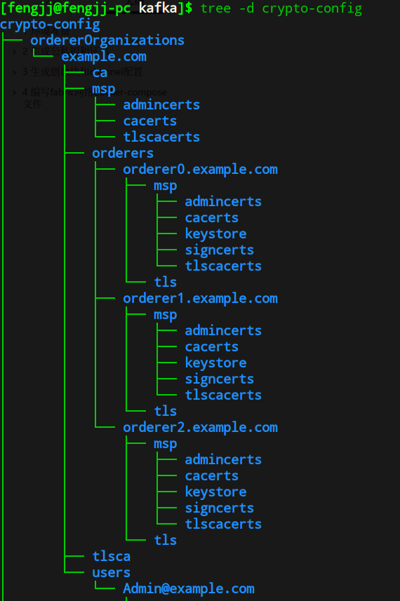
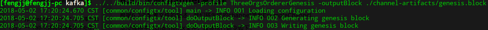
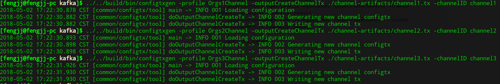
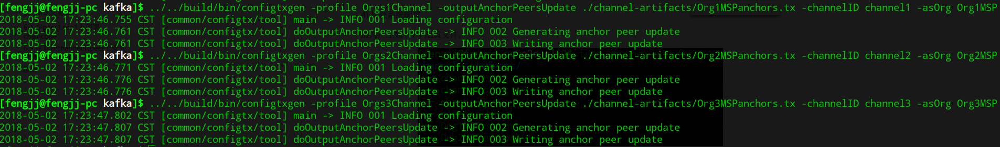
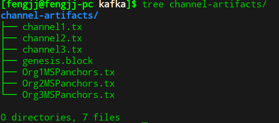

在上一篇[一步一步搭建hyperledger环境](./build_fabric_network_step_by_step.md)中，介绍了一步一步使用修改过的社区e2e例子，来搭建fabric多组织多通道的环境，其中的orderer采用solo单节点共识模式，在实际环境中，都应当采用基于kafka的分布式共识模式，提高程序的可靠性和安全性。下面介绍下搭建基于kafka的orderer集群部署的fabric network。

# 1 环境准备

参考[一步一步搭建hyperledger环境](./build_fabric_network_step_by_step.md)中的环境准备，安装好docker、make等程序，准备好部署

# 2 生成公私钥和证书

## 2.1 修改crypt-config

编译`cryptogen`后，即可生成orderer集群的配置，修改orderer部分的配置如下：

```yaml
OrdererOrgs:
  - Name: Orderer
    Domain: example.com
    #组织内只有一个节点时，通过Specs指定
    Specs:
      #指定orderer集群各节点主机名
      - Hostname: orderer0
      - Hostname: orderer1
      - Hostname: orderer2
PeerOrgs:
  - Name: Org1
    Domain: org1.example.com
    #组织内由一个或者多个节点时，通过template指定
    Template:
      #节点个数，生成的主机名按顺序peer0到peer{Count-1}
      Count: 2
    Users:
      #生成的除Admin之外的普通用户证书个数
      Count: 1
  - Name: Org2
    Domain: org2.example.com
    Template:
      Count: 2
    Users:
      Count: 1
  - Name: Org3
    Domain: org3.example.com
    Template:
      Count: 2
    Users:
      Count: 1
```

## 2.2 生成公私钥和证书

> 注意：为避免每次命令输入过长路径，将build/bin追加到`PATH`环境变量路径中。
>
> `export PATH=$PATH:../../build/bin`

执行下列命令，使用`crypto-config.yaml`配置生成orderer集群环境中的所有公私钥和证书。

`cryptogen generate --config=./crypto-config.yaml`

可使用`tree cryptogen-config -d`命令来检查目录，正常生成了各个orderer节点的证书配置，如下图所示：



# 3 生成创世块和channel配置

## 3.1 配置confitx.yaml

参考orderer集群配置，修改configtx.yaml中的orderer配置，将其修改为kafka共识模式，修改后的configtx.yaml内容如下所示：

```yaml
Profiles:

    ThreeOrgsOrdererGenesis:
        Orderer:
            <<: *OrdererDefaults
            Organizations:
                - *OrdererOrg
        #每个consortium都是一组成员的集合
        Consortiums:
            Consortium1:
                Organizations:
                    - *Org1
            Consortium2:
                Organizations:
                    - *Org2
            Consortium3:
                Organizations:
                    - *Org3
        
    Orgs1Channel:
        Consortium: Consortium1
        Application:
            <<: *ApplicationDefaults
            Organizations:
                - *Org1

    Orgs2Channel:
        Consortium: Consortium2
        Application:
            <<: *ApplicationDefaults
            Organizations:
                - *Org2

    Orgs3Channel:
        Consortium: Consortium3
        Application:
            <<: *ApplicationDefaults
            Organizations:
                - *Org3

#order组织和peer组织的配置
Organizations:

    # order组织的配置
    - &OrdererOrg

        Name: OrdererOrg

        ID: OrdererMSP

        MSPDir: crypto-config/ordererOrganizations/example.com/msp

    - &Org1
    
        Name: Org1MSP

        ID: Org1MSP

        MSPDir: crypto-config/peerOrganizations/org1.example.com/msp

        AnchorPeers:

            - Host: peer0.org1.example.com
              Port: 7051

    - &Org2

        Name: Org2MSP

        ID: Org2MSP

        MSPDir: crypto-config/peerOrganizations/org2.example.com/msp

        AnchorPeers:

            - Host: peer0.org2.example.com
              Port: 7051
    - &Org3

        Name: Org3MSP

        ID: Org3MSP

        MSPDir: crypto-config/peerOrganizations/org3.example.com/msp

        AnchorPeers:

            - Host: peer0.org3.example.com
              Port: 7051

#orderer的配置
Orderer: &OrdererDefaults

    # orderer共识模式，支持solo和kafka两种
    OrdererType: kafka

    # orderer集群服务地址
    Addresses:
        - orderer0.example.com:7050
        - orderer1.example.com:7050
        - orderer2.example.com:7050

    # 批次提交的间隔描述
    BatchTimeout: 2s

    # 控制多少个消息产生一个区块
    BatchSize:

        # Max Message Count: The maximum number of messages to permit in a batch
        MaxMessageCount: 10

        # 设置最大的区块大小。每个区块最大有Orderer.AbsoluteMaxBytes个字节（不包括头部）
        # 这个值的大小需要与kafka代理的配置保持一致
        AbsoluteMaxBytes: 99 MB

        # 设置每个区块建议的大小。Kafka对于相对小的消息提供更高的吞吐量；区块大小最好不要超过1MB
        PreferredMaxBytes: 512 KB

    Kafka:
        # kafka的代理地址，不需要是所有的代理地址，但最少要有两个
        # 所有orderer节点使用此代理地址连接
        Brokers:
            - kafka1:9092
            - kafka2:9092
            - kafka3:9092
            - kafka4:9092

    Organizations:

Application: &ApplicationDefaults

    Organizations:
```

>kafka需要最少4个节点才能组成一个容错的集群，如果一个代理崩溃了，channel还可以继续读写，也可以继续创建新的channel，否则会工作异常。

## 3.2 生成系统配置

1）使用如下命令，生成创世块

`configtxgen -profile ThreeOrgsOrdererGenesis -outputBlock ./channel-artifacts/genesis.block`

产生如下输出，表示创世块生成成功



2）使用下面的命令，生成各个通道的交易配置

```bash
configtxgen -profile Orgs1Channel -outputCreateChannelTx ./channel-artifacts/channel1.tx -channelID channel1
configtxgen -profile Orgs2Channel -outputCreateChannelTx ./channel-artifacts/channel2.tx -channelID channel2
configtxgen -profile Orgs3Channel -outputCreateChannelTx ./channel-artifacts/channel3.tx -channelID channel3
```

产生如下输出，表示创建成功。



3）使用下面的命令，生成各组织的锚节点交易配置。

```bash
configtxgen -profile Orgs1Channel -outputAnchorPeersUpdate ./channel-artifacts/Org1MSPanchors.tx -channelID channel1 -asOrg Org1MSP
configtxgen -profile Orgs2Channel -outputAnchorPeersUpdate ./channel-artifacts/Org2MSPanchors.tx -channelID channel2 -asOrg Org2MSP
configtxgen -profile Orgs3Channel -outputAnchorPeersUpdate ./channel-artifacts/Org3MSPanchors.tx -channelID channel3 -asOrg Org3MSP
```



最终产生下面7个系统配置文件文件



# 4 编写fabric网络docker-compose文件

## 4.1 zookeeper集群配置yaml

zookeeper的节点个数需要为奇数，根据节点能力使用3或5或7，超过7个可能会造成不必要的资源浪费。

以其中一个的yaml配置为例

```
zookeeper0.example.com:
    container_name: zookeeper0.example.com
    image: hyperledger/fabric-zookeeper
    environment:
      #zookeeper服务器列表，server.1表示ID为1的节点信息
      #2888端口是follower连接leader使用，3888端口用户节点间选举leader
      - ZOO_SERVERS=server.1=zookeeper0.example.com:2888:3888 server.2=zookeeper1.example.com:2888:3888 server.3=zookeeper2.example.com:2888:3888
      #当前节点的ID，不允许重复，范围在1-255之间。
      #保持与ZOO_SERVERS中顺序一致
      - ZOO_MY_ID=1
    expose:
      - 2181
      - 2888
      - 3888
```

其他几个zookeeper节点的配置类似，只是`ZOO_MY_ID依次`为2、3，且不重复即可。

##4.2 kafka集群配置yaml

若要保证容错性，kafka集群最少需要4台服务器来保证，此时允许1个代理出现问题。

kafka0的yaml配置如下所示：

```yaml
kafka0.example.com:
    container_name: kafka0.example.com
    image: hyperledger/fabric-kafka
    restart: always
    environment:
      #kafka代理ID，保持不重复的整数即可
      - KAFKA_BROKER_ID=0
      # 在configtx.yaml中会设置最大的区块大小（参考configtx.yaml中AbsoluteMaxBytes参数）。
      # 每个区块最大有Orderer.AbsoluteMaxBytes个字节（不包括头部），假定这里设置的值为A（目前99）。
      # message.max.bytes和replica.fetch.max.bytes应该设置一个大于A。
      # 为header增加一些缓冲区空间---1MB已经足够大。上述不同设置值之间满足如下关系：
      # Orderer.AbsoluteMaxBytes < replica.fetch.max.bytes <= message.max.bytes
      # （更完整的是，message.max.bytes应该严格小于socket.request.max.bytes的值，socket.request.max.bytes的值默认被设置为100MB。
      # 如果想要区块的大小大于100MB，需要编辑fabric/orderer/kafka/config.go文件里硬编码的值brokerConfig.Producer.MaxMessageBytes，
      # 修改后重新编译源码得到二进制文件，这种设置是不建议的。）
      - KAFKA_MESSAGE_MAX_BYTES=103809024
      # 试图为每个通道获取的消息的字节数。
      # 这不是绝对最大值，如果获取的信息大于这个值，则仍然会返回信息，以确保可以取得进展。
      # 代理所接受的最大消息大小是通过上一条message.max.bytes定义的。
      - KAFKA_REPLICA_FETCH_MAX_BYTES=103809024
      # 数据一致性在区块链环境中是至关重要的。
      # 我们不能从in-sync 副本（ISR）集合之外选取channel leader，
      # 否则我们将会面临对于之前的leader产生的offsets覆盖的风险，
      # 这样的结果是，orderers产生的区块可能会重新写入区块链。
      - KAFKA_UNCLEAN_LEADER_ELECTION_ENABLE=false
      # min.insync.replicas = M---设置一个M值（例如1<M<N，查看下面的default.replication.factor）
      # 数据提交时会写入至少M个副本（这些数据然后会被同步并且归属到in-sync 副本集合或ISR）。
      # 其它情况，写入操作会返回一个错误。接下来：
      # 1）如果channel写入的数据多达N-M个副本变的不可用，操作可以正常执行。
      # 2）如果有更多的副本不可用，Kafka不可以维护一个有M数量的ISR集合，因此Kafka停止接收写操作。Channel只有当同步M个副本后才可以重新可以写。
      - KAFKA_MIN_INSYNC_REPLICAS=2
      # 设置一个值N，N<K。
      # 设置replication factor参数为N代表着每个channel都保存N个副本的数据到Kafka的代理上。
      # 这些都是一个channel的ISR集合的候选。
      # 如同在上边min.insync.replicas section设置部分所描述的，不是所有的代理（orderer）在任何时候都是可用的。
      # N的值必须小于K，如果少于N个代理的话，channel的创建是不能成功的。
      # 因此，如果设置N的值为K，一个代理失效后，那么区块链网络将不能再创建新的channel---orderering service的crash容错也就不存在了。
      - KAFKA_DEFAULT_REPLICATION_FACTOR=3
      #zookeeper节点集合
      - KAFKA_ZOOKEEPER_CONNECT=zookeeper0.example.com:2181,zookeeper1.example.com:2181,zookeeper2.example.com:2181
    expose:
      - 9092
      - 9093
```

## 4.3 orderer配置修改

相对与solo模式，orderer节点的环境变量配置稍有变动，其中一个order的配置如下所示：

```yaml
orderer0.example.com:
    container_name: orderer0.example.com
    image: hyperledger/fabric-orderer
    environment:
      - ORDERER_GENERAL_LOGLEVEL=debug
      - ORDERER_GENERAL_LISTENADDRESS=0.0.0.0
      - ORDERER_GENERAL_GENESISMETHOD=file
      - ORDERER_GENERAL_GENESISFILE=/var/hyperledger/orderer/orderer.genesis.block
      - ORDERER_GENERAL_LOCALMSPID=OrdererMSP
      - ORDERER_GENERAL_LOCALMSPDIR=/var/hyperledger/orderer/msp
      # enabled TLS
      - ORDERER_GENERAL_TLS_ENABLED=true
      - ORDERER_GENERAL_TLS_PRIVATEKEY=/var/hyperledger/orderer/tls/server.key
      - ORDERER_GENERAL_TLS_CERTIFICATE=/var/hyperledger/orderer/tls/server.crt
      - ORDERER_GENERAL_TLS_ROOTCAS=[/var/hyperledger/orderer/tls/ca.crt]
      # 增加kafka相关配置
      - ORDERER_KAFKA_RETRY_SHORTINTERVAL=1s
      - ORDERER_KAFKA_RETRY_SHORTTOTAL=30s
      - ORDERER_KAFKA_RETRY_LONGINTERVAL=10s 
      - ORDERER_KAFKA_RETRY_LONGTOTAL=100s
      - ORDERER_KAFKA_VERBOSE=true
    working_dir: /opt/gopath/src/github.com/hyperledger/fabric
    command: orderer
    #注意载卷的路径
    volumes:
      - ../channel-artifacts/genesis.block:/var/hyperledger/orderer/orderer.genesis.block
      - ../crypto-config/ordererOrganizations/example.com/orderers/orderer0.example.com/msp:/var/hyperledger/orderer/msp
      - ../crypto-config/ordererOrganizations/example.com/orderers/orderer0.example.com/tls/:/var/hyperledger/orderer/tls
    ports:
      - 7050:7050
```

> 在前面的configtx.yaml配置中，已经增加了orderer集群连接的kafka集群地址，orderer在启动时，可以直接从创世块中读取使用。

# 5 启动orderer集群的fabric环境

> 注意：启动前，手动拉取下列相关镜像的1.0.0版本，并更名为latest版本。
>
> - hyperledger/fabric-tools:x86_64-1.0.0
> - hyperledger/fabric-orderer:x86_64-1.0.0
> - hyperledger/fabric-peer:x86_64-1.0.0
> - hyperledger/fabric-zookeeper:x86_64-1.0.0
> - hyperledger/fabric-kafka:x86_64-1.0.0

使用命令`docker-comose -f docker-compose-kafka.yaml up -d`启动测试环境。

在容器`cli`中依次执行下列命令，测试channel创建、peer加入channel、chaincode的安装和交易测试。

```bash
ORDERER_CA=/opt/gopath/src/github.com/hyperledger/fabric/peer/crypto/ordererOrganizations/example.com/orderers/orderer0.example.com/msp/tlscacerts/tlsca.example.com-cert.pem

peer channel create -o orderer0.example.com:7050 -c channel1 -f ./channel-artifacts/channel1.tx --tls true --cafile $ORDERER_CA

peer channel join -b channel1.block

peer channel update -o orderer0.example.com:7050 -c channel1 -f ./channel-artifacts/Org1MSPanchors.tx --tls true --cafile $ORDERER_CA

peer chaincode install -n mycc -v 1.0 -p github.com/chaincode/chaincode_example02/go/

peer chaincode instantiate -o orderer0.example.com:7050 --tls true --cafile $ORDERER_CA -C channel1 -n mycc -v 1.0 -c '{"Args":["init","a","100","b","200"]}'

peer chaincode query -C channel1 -n mycc -c '{"Args":["query","a"]}'

peer chaincode invoke -o orderer0.example.com:7050  --tls true --cafile $ORDERER_CA -C channel1 -n mycc -c '{"Args":["invoke","b","a","1"]}'
```

更多的测试细节可参考[一步一步搭建hyperledger环境](./build_fabric_network_step_by_step.md)中的测试章节来进行验证。

# 6 总结

至此，我们完成了kafka共识的orderer集群的搭建，并测试了基本的区块链业务功能。在实际生产环境中，更多的是对orderer、kafka、zookeeper参数的调校，达到符合环境的最佳性能要求。如果需要增加orderer、kafka、zookeeper等更多节点来提高可靠性，可参考文档示例增加相应配置即可。

