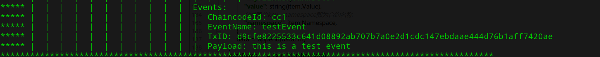
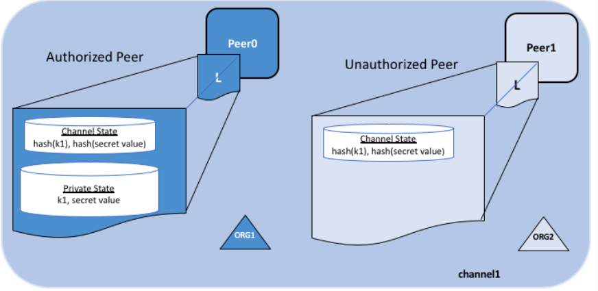

[TOC]

# 最简合约

fabric的智能合约规范需要定义一个struct（结构体的名称不限），然后在该struct上定义Init和Invoke两个函数，定义main函数为启动入口，下面是社区最简单合约的模板，一切合约都需要在此基础上进行扩展：

```go
package main

import (
	"github.com/hyperledger/fabric/core/chaincode/shim"
	"fmt"
	pb "github.com/hyperledger/fabric/protos/peer"
)

type FoozyCode struct {
}

func main() {
	err := shim.Start(new(FoozyCode))
	if err != nil {
		fmt.Printf("Error starting chain code: %s", err)
	}
}

func (fuzzy *FoozyCode) Init(stub shim.ChaincodeStubInterface) pb.Response {
	return shim.Success(nil)
}

//peer的invoke和query都是调用此方法实现的
func (fuzzy *FoozyCode) Invoke(stub shim.ChaincodeStubInterface) pb.Response {
	//shim.Error产生异常响应，通知操作失败
	//shim.Error("error test")
	//shim.Success产生正常响应，通知操作成功
	return shim.Success(nil)
}
```

在Invoke和Init中，开发者可以根据需要再进行扩展。同时，shim提供了一系列接口，供开发者调用使用。

> 由于智能合约本身是无法直接访问账本的，必须通过gprc调用peer来操作账本，因此目前开发者也只能使用shim提供的接口来开发自定义合约。

# 智能合约接口

## 请求参数获取

- GetArgs():`[][]byte`，调用参数以二维数组方式获取。
- GetStringArgs:`[]string`，调用参数解析为字符串数组，如果无法转换可能出现乱码
- GetFuntionAndParameters:`string,[]string`，调用参数解析为字符串数组，以第一个为函数名，后面为参数数组，如果一个参数都没有，则两个都是空值
- GetArgsSlice():`[]byte`，将调用参数的二维数组强行转换为一维数组
- GetTransient():`map[string][]byte,error`，比较少用，用于存放调用提案中的临时参数，只在节点的本地存储，其他节点不存储此参数，通常用来存放加解密用的密钥等信息。

## 提取调用者身份

- GetCreator():`[]byte,error`，获取调用者的身份证书，其内容为证书字符串，可以通过x509类库转换读取证书判断信息。现在fabric提供了cid类库可以直接进行相关操作，它通过golang的protobuf将creator转换为可用的身份信息
- cid.GetID():`string,error`，获取调用者的身份，实际使用证书的subject和issuer用base64编码生成的字符串
- cid.GetMSPID():`string,error`，获取调用者的组织msp id
- cid.GetX509Certificate():`*x509.Certificate,error`，获取调用者的证书，已经完成转换
- cid.GetAttributeValue(att ):`value string,error`，获取调用者证书上的扩展属性值
- cid.AssertAttributeValue(attName,value ):`error`，判断调用者证书上的扩展属性值是否匹配指定值

示例合约函数：

```go
func (code *ExampleChainCode01) getCreator(stub shim.ChaincodeStubInterface) pb.Response {
	id, _ := cid.GetID(stub)
	mspId, _ := cid.GetMSPID(stub)
	//获取证书上通过fabric-ca增加的额外自定义属性
	//cid.GetAttributeValue(stub,"")
	//读取整个证书，可用于获取其他属性
	certs, _ := cid.GetX509Certificate(stub)
	//creator字节码转换为字符串后，可见调用者身份和证书信息，使用protobuf解析后可获取这些身份
	bs, _ := stub.GetCreator()
	fmt.Println(string(bs))
	data := make(map[string]interface{})
	//需要base64解码获取cn
	idBytes, _ := base64.StdEncoding.DecodeString(id)
	data["id"] = string(idBytes)
	data["cn"] = certs.Subject.CommonName
	data["msp_id"] = mspId
	data["issuer"] = certs.Issuer
	data["validity_start"] = certs.NotBefore
	data["validity_end"] = certs.NotAfter
	data["subject"] = certs.Subject
	dataBytes, _ := json.Marshal(data)
	return shim.Success(dataBytes)
}
```

示例输出

```shell
➜ peer chaincode query -C channel1 -n cc1 -c '{"Args":["getCreator"]}'
2018-09-12 09:26:04.690 CST [chaincodeCmd] checkChaincodeCmdParams -> INFO 001 Using default escc
2018-09-12 09:26:04.690 CST [chaincodeCmd] checkChaincodeCmdParams -> INFO 002 Using default vscc
Query Result: {"cn":"Admin@org1.demo.com","id":"x509::CN=Admin@org1.demo.com,OU=client,L=Xi'An,ST=ShaanXi,C=CN::CN=ca.org1.demo.com,O=org1.demo.com,L=Xi'An,ST=ShaanXi,C=CN","issuer":{"Country":["CN"],"Organization":["org1.demo.com"],"OrganizationalUnit":null,"Locality":["Xi'An"],"Province":["ShaanXi"],"StreetAddress":null,"PostalCode":null,"SerialNumber":"","CommonName":"ca.org1.demo.com","Names":[{"Type":[2,5,4,6],"Value":"CN"},{"Type":[2,5,4,8],"Value":"ShaanXi"},{"Type":[2,5,4,7],"Value":"Xi'An"},{"Type":[2,5,4,10],"Value":"org1.demo.com"},{"Type":[2,5,4,3],"Value":"ca.org1.demo.com"}],"ExtraNames":null},"msp_id":"org1","subject":{"Country":["CN"],"Organization":null,"OrganizationalUnit":["client"],"Locality":["Xi'An"],"Province":["ShaanXi"],"StreetAddress":null,"PostalCode":null,"SerialNumber":"","CommonName":"Admin@org1.demo.com","Names":[{"Type":[2,5,4,6],"Value":"CN"},{"Type":[2,5,4,8],"Value":"ShaanXi"},{"Type":[2,5,4,7],"Value":"Xi'An"},{"Type":[2,5,4,11],"Value":"client"},{"Type":[2,5,4,3],"Value":"Admin@org1.demo.com"}],"ExtraNames":null},"validity_end":"2028-09-09T01:02:10Z","validity_start":"2018-09-12T01:02:10Z"}
2018-09-12 09:26:04.696 CST [main] main -> INFO 003 Exiting.....
```

## 存取数据

- GetState(key string):`[]byte,error`,如果不存在，则为nil，ni。在同一交易中Put的数据不会被Get最新值。**使用query调用GetState不会产生交易，但是用invoke调用GetState会产生读写集不需要写的交易区块**

- PutState(key string,value []byte):`error`存入数据，在交易中产生writeset记录，key不能以空字符（0x00）开始，避免与复合key冲突。**任何需要写入数据的方法，使用query调用时，不会产生任何效果，但使用invoke可以调用只包含query的方法**

- DelState(key string):`error`，删除key对应的key、value，在交易中产生writeset记录，不存在则产生异常。

- GetStateByRange(start,end string):`StateQueryIteratorInterface,error`，按key做范围查询，范围一个迭代器，用于遍历结果集，结果按key的字典顺序进行遍历。范围为左开右闭，即最小包括起始值，但不包括终止值。

  *预设存储了[a:valueXX,a0:a0,a1:a1,b:b]四对键值对*

  示例智能合约函数

  ```go
  func (code *ExampleChainCode01) getRange(stub shim.ChaincodeStubInterface, args []string) pb.Response {
  	if len(args) < 2 {
  		return shim.Error("invalid args length")
  	}
  	start, end := args[0], args[1]
  	//左开右闭原则，包含start值，不包含end值
  	result, err := stub.GetStateByRange(start, end)
  	if err != nil {
  		return shim.Error(err.Error())
  	}
  	defer result.Close()
  	data := make([]map[string]interface{}, 0)
  	for result.HasNext() {
  		item, err := result.Next()
  		if err != nil {
  			return shim.Error(err.Error())
  		}
  		m := map[string]interface{}{
  			"key":   item.Key,
  			"value": string(item.Value),
  			//对简单key，namespace即为合约名称
  			"namespace": item.Namespace,
  		}
  		data = append(data, m)
  	}
  	dataBytes, _ := json.Marshal(data)
  	return shim.Success(dataBytes)
  }
  ```

  示例查询输出（左开右闭，不包含key为b的数据记录）

  ```shell
  ➜  peer chaincode query -C channel1 -n cc1 -c '{"Args":["rangeQuery","a","b"]}' 
  2018-09-12 10:06:07.825 CST [chaincodeCmd] checkChaincodeCmdParams -> INFO 001 Using default escc
  2018-09-12 10:06:07.825 CST [chaincodeCmd] checkChaincodeCmdParams -> INFO 002 Using default vscc
  Query Result: [{"key":"a","namespace":"cc1","value":"valueXX"},{"key":"a0","namespace":"cc1","value":"a0"},{"key":"a1","namespace":"cc1","value":"a1"}]
  2018-09-12 10:06:07.832 CST [main] main -> INFO 003 Exiting.....
  ```

- GetHistoryForKey(key string):`HistoryQueryIteratorInterface,error`，获取key的历史数据，如果key始终不存在，不报错。**如果key已经被删除，可以查询出历史值**。core.yaml中配置项*core.ledger.history.enableHistoryDatabase*为false时无法查询历史。

  示例智能合约函数

  ```go
  func (code *ExampleChainCode01) getKeyHistory(stub shim.ChaincodeStubInterface, args []string) pb.Response {
  	if len(args) < 1 {
  		return shim.Error("invalid args length")
  	}
  	key := args[0]
  	result, err := stub.GetHistoryForKey(key)
  	if err != nil {
  		return shim.Error(err.Error())
  	}
  	defer result.Close()
  	data := make([]map[string]interface{}, 0)
  	for result.HasNext() {
  		item, err := result.Next()
  		if err != nil {
  			return shim.Error(err.Error())
  		}
  		m := map[string]interface{}{
  			"is_delete": item.IsDelete,
  			//时间需要通过time转换为可读时间字符串
  			"timestamp": time.Unix(item.Timestamp.Seconds, int64(item.Timestamp.Nanos)),
  			//修改值的交易ID
  			"tx_id": item.TxId,
  			"value": string(item.Value),
  		}
  		data = append(data, m)
  	}
  	resultBytes, _ := json.Marshal(data)
  	return shim.Success(resultBytes)
  }
  ```

  示例查询响应

  ```shell
  ➜  peer chaincode query -C channel1 -n cc1 -c '{"Args":["history","a"]}'                          
  2018-09-12 10:11:15.863 CST [chaincodeCmd] checkChaincodeCmdParams -> INFO 001 Using default escc
  2018-09-12 10:11:15.864 CST [chaincodeCmd] checkChaincodeCmdParams -> INFO 002 Using default vscc
  Query Result: [{"is_delete":false,"timestamp":"2018-09-12T01:33:09.180084548Z","tx_id":"dec8faf9b693865517a76d3edb02ec01d4de498abdbba7315eeb4157b9cc92ab","value":"valuea"},{"is_delete":false,"timestamp":"2018-09-12T01:34:55.163499101Z","tx_id":"e41616d9f08fce63d0ee485fbc075c9d92758c377b42cb085412c3a18fe4d5b7","value":"valueXX"},{"is_delete":true,"timestamp":"2018-09-12T02:11:11.822707793Z","tx_id":"8287fa1d26a3d8d48e8a2eac00f261c7bd2da31bc201d320b682efc448d2380b","value":""}]
  2018-09-12 10:11:15.870 CST [main] main -> INFO 003 Exiting.....
  ```


## 使用复合键

使用复合键存取时，关键时复合键本身的获取，实际上是通过固定程序在复合的多个属性和对应key值之间的字符串拼接和分割处理。

- CreateCompositeKey(objectType string,attrs []string):`key string,error`，根据对象类型和属性生成复合键，实际上是把objectType和attrs列表用`\x00`开头，然后用空值`U+0000`拼接成字符串，这些事为什么简单key不能以空值开头的原因。

示例智能合约函数

```go
func (code *ExampleChainCode02) createBoard(stub shim.ChaincodeStubInterface, args []string) pb.Response {
	if len(args) < 3 {
		return shim.Error("not enough args")
	}
	owner, color, shape := args[0], args[1], args[2]
	//生成的复合key根据对象类型和属性列表用U+0000拼接成字符串作为key
	key, err := stub.CreateCompositeKey("owner_color", []string{owner, color})
	//预期输出U+0000owner_colorU+0000<owner>U+0000colorU+0000
	if err != nil {
		return shim.Error(err.Error())
	}
	board := new(Board)
	board.Owner = owner
	board.Color = color
	board.Shape = shape
	boardBytes, _ := json.Marshal(board)
	err = stub.PutState(key, boardBytes)
	return shim.Success([]byte(key))
}
```

调用合约产生的可以检查产生和复合键值

```shell
➜  peer chaincode invoke -C channel1 -n cc -c '{"Args":["create","mark","red","square"]}' --tls --cafile $ORDERER_CA
2018-09-12 17:20:50.651 CST [chaincodeCmd] InitCmdFactory -> INFO 001 Get chain(channel1) orderer endpoint: orderer0.demo.com:7050
2018-09-12 17:20:50.656 CST [chaincodeCmd] checkChaincodeCmdParams -> INFO 002 Using default escc
2018-09-12 17:20:50.657 CST [chaincodeCmd] checkChaincodeCmdParams -> INFO 003 Using default vscc
2018-09-12 17:20:50.664 CST [chaincodeCmd] chaincodeInvokeOrQuery -> INFO 004 Chaincode invoke successful. result: status:200 payload:"\000owner_color\000mark\000red\000" 
2018-09-12 17:20:50.664 CST [main] main -> INFO 005 Exiting.....
```

- SplitCompositeKey(key string):`(objectType string,attrs []string,error)`，将复合键切割，返回对象类型和属性列表，实际上是把objectType和attrs列表用`\x00`切割字符串

- GetStateByPartialCompositeKey(objectType string,partialAttrs []string):`StateQueryIteratorInterface,error`，按复合键的部分属性查询。实际以这部分属性生成一个临时复合键，用作**前缀匹配**，获取所有匹配到的键值对，**不支持其他方式的匹配，如果要实现，需要启用couchdb，进行复杂查询**。

  > 实际上转换为GetStateByRange查询，起始为临时复合键，终止为临时复合键+U+10FFFF

  假设有["mark","red","square"]和["mark","green","star"]两组数据，二者复合键不同，按mark这个owner单一属性做前缀查询后，可以获取到他的所有数据。

示例智能合约函数

```go
func (code *ExampleChainCode02) getByOwner(stub shim.ChaincodeStubInterface, args []string) pb.Response {
	if len(args) < 1 {
		return shim.Error("not enough args")
	}
	owner := args[0]
	//按对象类型和部分属性生成临时复合键，做前缀查询
	result, err := stub.GetStateByPartialCompositeKey("owner_color", []string{owner})
	if err != nil {
		return shim.Error(err.Error())
	}
	defer result.Close()
	boards := make([]map[string]interface{}, 0)
	for result.HasNext() {
		item, err := result.Next()
		if err != nil {
			return shim.Error(err.Error())
		}
		key := item.Key
		//分割后的复合键，可以按属性顺序读取
		objectType, args, err := stub.SplitCompositeKey(key)
		if err != nil {
			return shim.Error(err.Error())
		}
		value := item.Value
		board := new(Board)
		json.Unmarshal(value, board)
		data := map[string]interface{}{
			"object_type": objectType,
			"owner":       args[0],
			"color":       args[1],
			"shape":       board.Shape,
		}
		boards = append(boards, data)
	}
	boardsBytes, _ := json.Marshal(boards)
	return shim.Success(boardsBytes)
}
```

调用结果

```shell
#前缀查询能正常产生结果
➜  peer chaincode query -C channel1 -n cc -c '{"Args":["getByOwner","mark"]}'                                       
2018-09-12 17:29:12.190 CST [chaincodeCmd] checkChaincodeCmdParams -> INFO 001 Using default escc
2018-09-12 17:29:12.190 CST [chaincodeCmd] checkChaincodeCmdParams -> INFO 002 Using default vscc
Query Result: [{"color":"green","object_type":"owner_color","owner":"mark","shape":"star"},{"color":"red","object_type":"owner_color","owner":"mark","shape":"square"}]
2018-09-12 17:29:12.196 CST [main] main -> INFO 003 Exiting.....
#无法按后缀做查询
➜ peer chaincode query -C channel1 -n cc -c '{"Args":["getByOwner","red"]}' 
2018-09-12 17:31:50.349 CST [chaincodeCmd] checkChaincodeCmdParams -> INFO 001 Using default escc
2018-09-12 17:31:50.349 CST [chaincodeCmd] checkChaincodeCmdParams -> INFO 002 Using default vscc
Query Result: []
2018-09-12 17:31:50.354 CST [main] main -> INFO 003 Exiting.....
```


## 链式调用其他合约

- InvokeChaincode(chaincodeName string, args `[][]byte`, channel string) `pb.Response`：以当前身份调用其他智能合约。如果channel为空值，则在当前通道上调用合约。

  在**当前交易中**调用其他合约，

  以query方式调用时，无论被调用合约是否在同一个通道，无论被调用合约是否包含`PutState`的操作，都可以正常返回响应，但不会记入账本产生区块。

  以invoke方式调用时，

  **被调用合约处于同一通道**时，当前合约把产生的读写集放到当前交易的读写集中，提交到账本上。

  ```shell
  #调用同一通道的合约，被调用合约生成的读写集，存储到区块中
  ➜  peer chaincode invoke -C channel1 -n cc1 -c  '{"Args":["callCode","channel1","example02","invoke","a","b","10"]}' --tls --cafile $ORDERER_CA
  2018-09-12 11:19:12.191 CST [chaincodeCmd] InitCmdFactory -> INFO 001 Get chain(channel1) orderer endpoint: orderer0.demo.com:7050
  2018-09-12 11:19:12.195 CST [chaincodeCmd] checkChaincodeCmdParams -> INFO 002 Using default escc
  2018-09-12 11:19:12.195 CST [chaincodeCmd] checkChaincodeCmdParams -> INFO 003 Using default vscc
  2018-09-12 11:19:12.211 CST [chaincodeCmd] chaincodeInvokeOrQuery -> INFO 004 Chaincode invoke successful. result: status:200 payload:"{\"message\":\"\",\"payload\":\"\"}" 
  2018-09-12 11:19:12.211 CST [main] main -> INFO 005 Exiting.....
  #被调用合约中的数据可以检查到变化
  ➜  peer chaincode query -C channel1 -n example02 -c '{"Args":["query","a"]}'
  2018-09-12 11:19:15.552 CST [chaincodeCmd] checkChaincodeCmdParams -> INFO 001 Using default escc
  2018-09-12 11:19:15.552 CST [chaincodeCmd] checkChaincodeCmdParams -> INFO 002 Using default vscc
  Query Result: 80
  2018-09-12 11:19:15.557 CST [main] main -> INFO 003 Exiting.....
  ```

   如果**被调用合约即为当前通道上的合约自己**，可以正常响应产生结果集，但不会被记入账本。

  ```shell
  #合约自己调用自己，可以正常响应
  ➜  peer chaincode invoke -C channel1 -n cc1 -c  '{"Args":["callCode","channel1","cc1","put","a","cc1a"]}' --tls --cafile $ORDERER_CA
  2018-09-12 11:42:18.452 CST [chaincodeCmd] InitCmdFactory -> INFO 001 Get chain(channel1) orderer endpoint: orderer0.demo.com:7050
  2018-09-12 11:42:18.456 CST [chaincodeCmd] checkChaincodeCmdParams -> INFO 002 Using default escc
  2018-09-12 11:42:18.456 CST [chaincodeCmd] checkChaincodeCmdParams -> INFO 003 Using default vscc
  2018-09-12 11:42:18.466 CST [chaincodeCmd] chaincodeInvokeOrQuery -> INFO 004 Chaincode invoke successful. result: status:200 payload:"{\"message\":\"\",\"payload\":\"\"}" 
  2018-09-12 11:42:18.466 CST [main] main -> INFO 005 Exiting.....
  #实际并未记入账本，读取不到数据
  ➜  peer chaincode query -C channel1 -n cc1 -c '{"Args":["get","a"]}'
  2018-09-12 11:42:53.689 CST [chaincodeCmd] checkChaincodeCmdParams -> INFO 001 Using default escc
  2018-09-12 11:42:53.689 CST [chaincodeCmd] checkChaincodeCmdParams -> INFO 002 Using default vscc
  Query Result: 
  2018-09-12 11:42:53.694 CST [main] main -> INFO 003 Exiting.....
  ```

  **被调用合约处于不同通道上**时，被调用合约不产生读写集也不记入账本，只产生正常响应，当前合约生成的读写集才会计入到账本上。

  ```shell
  #调用另一个通道上的合约，正常产生响应
  ➜  peer chaincode invoke -C channel1 -n cc1 -c  '{"Args":["callCode","channel2","example02","invoke","a","b","10"]}' --tls --cafile $ORDERER_CA
  2018-09-12 11:19:12.191 CST [chaincodeCmd] InitCmdFactory -> INFO 001 Get chain(channel1) orderer endpoint: orderer0.demo.com:7050
  2018-09-12 11:19:12.195 CST [chaincodeCmd] checkChaincodeCmdParams -> INFO 002 Using default escc
  2018-09-12 11:19:12.195 CST [chaincodeCmd] checkChaincodeCmdParams -> INFO 003 Using default vscc
  2018-09-12 11:19:12.211 CST [chaincodeCmd] chaincodeInvokeOrQuery -> INFO 004 Chaincode invoke successful. result: status:200 payload:"{\"message\":\"\",\"payload\":\"\"}" 
  2018-09-12 11:19:12.211 CST [main] main -> INFO 005 Exiting.....
  #另一个合约上的数据不会产生变化
  ➜  peer chaincode query -C channel2 -n example02 -c '{"Args":["query","a"]}'
  2018-09-12 11:26:14.971 CST [chaincodeCmd] checkChaincodeCmdParams -> INFO 001 Using default escc
  2018-09-12 11:26:14.971 CST [chaincodeCmd] checkChaincodeCmdParams -> INFO 002 Using default vscc
  Query Result: 100
  2018-09-12 11:26:14.975 CST [main] main -> INFO 003 Exiting.....             
  ```

## 自定义事件内容

- SetEvent(name string,payload []byte)：自定义设置事件内容，client最终可以通过eventhub获取到。

示例智能合约函数

```go
func (code *ExampleChainCode01) sendEvent(stub shim.ChaincodeStubInterface, args []string) pb.Response {
	stub.SetEvent("testEvent", []byte("this is a test event"))
	return shim.Success(nil)
}
```

通过invoke调用后，监听区块事件，可读取到消息内容，如下图所示：



## rich query

GetQueryResult(query string):`StateQueryIteratorInterface,error`

按值做富查询，peer必须使用couchdb作为状态数据库。查询语句不符合语法时，产生错误

- 合约代码目录下`META-INF/statedb/couchdb/indexes`必须包含合约所使用的索引定义文件
- 索引按[couchdb规范](http://docs.couchdb.org/en/2.1.1/api/database/find.html#db-index)，以*.json方式存放索引定义。**fabric在部署合约时，会自动创建索引。这也是为什么peer访问couchdb时，需要使用管理员的用户名密码的原因**
- **如果不定义索引，也可以使用查询，只是效率可能会低一些**

示例索引定义

```json
{"index":{"fields":["docType","owner"]},"ddoc":"indexOwnerDoc", "name":"indexOwner","type":"json"}
```

预先构建下面一组数据

```shell
"mark","red","star"
"mark","blue","star"
"juli","red","star"
"juli","blue","star"
#使用合约的创建功能
peer chaincode invoke -C channel1 -n cc -c '{"Args":["create","mark","green","star"]}' --tls --cafile $ORDERER_CA
```

示例查询智能合约

```go
func (code *ExampleChainCode03) getByQuery(stub shim.ChaincodeStubInterface, args []string) pb.Response {
	if len(args) < 1 {
		return shim.Error("not enough args")
	}
	queryString := args[0]
    //按owner查询时，查询语句queryString := fmt.Sprintf("{\"selector\":{\"docType\":\"%s\",\"owner\":\"%s\"}}", docType, owner)
	result, err := stub.GetQueryResult(queryString)
	if err != nil {
		return shim.Error(err.Error())
	}
	defer result.Close()
	boards := make([]*Board, 0)
	for result.HasNext() {
		item, err := result.Next()
		if err != nil {
			return shim.Error(err.Error())
		}
		value := item.Value
		board := new(Board)
		json.Unmarshal(value, board)
		boards = append(boards, board)
	}
	boardsBytes, _ := json.Marshal(boards)
	return shim.Success(boardsBytes)
	return shim.Success(boardsBytes)
}

```

示例响应

```shell
#使用索引按owner查询
➜  peer chaincode query -C channel1 -n cc -c '{"Args":["getByQuery","{\"selector\":{\"docType\":\"board\",\"owner\":\"mark\"}}"]}'
2018-09-13 11:10:39.079 CST [chaincodeCmd] checkChaincodeCmdParams -> INFO 001 Using default escc
2018-09-13 11:10:39.079 CST [chaincodeCmd] checkChaincodeCmdParams -> INFO 002 Using default vscc
Query Result: [{"docType":"board","owner":"mark","color":"blue","shape":"star"},{"docType":"board","owner":"mark","color":"green","shape":"star"},{"docType":"board","owner":"mark","color":"red","shape":"star"}]
2018-09-13 11:10:39.096 CST [main] main -> INFO 003 Exiting.....
#不使用索引，按color查询，也可以正常产生结果
➜  demo git:(master) peer chaincode query -C channel1 -n cc -c '{"Args":["getByQuery","{\"selector\":{\"color\":\"red\"}}"]}' 
2018-09-13 11:11:34.044 CST [chaincodeCmd] checkChaincodeCmdParams -> INFO 001 Using default escc
2018-09-13 11:11:34.044 CST [chaincodeCmd] checkChaincodeCmdParams -> INFO 002 Using default vscc
Query Result: [{"docType":"board","owner":"juli","color":"red","shape":"star"},{"docType":"board","owner":"mark","color":"red","shape":"star"}]
2018-09-13 11:11:34.058 CST [main] main -> INFO 003 Exiting.....
```

## private data collection

private data collection是1.2版本的新增功能，用于在通道中再进行更细粒度的数据隔离。本质上是通过旁路数据库实现的，其结构类似下图所示：



- 授权节点通过gossip协议相互传播，将私有数据保存在节点本地的旁路数据库中
- 未授权节点无法获取私有数据的值，只能存放私有数据的哈希值，用做背书、排序、记账等等。**orderer服务也不会看到私有数据的值**。
- 所有节点，无论授权或者未被授权，都可以保存一份key，value的hash后的键值对

对应上述接口，private data collections提供了一系列用于操作私有数据的接口。

> **不支持对私有数据的key做history查询**
>
> **存储私有数据时，key相同而collection不同是两份不同的数据**

示例集合配置文件

```json
[
  {
    "name": "collection1",
    "policy": "OR('org1.member')",
    "requiredPeerCount": 0,
    "maxPeerCount": 3,
    "blockToLive": 1000000
  },
  {
    "name": "collection2",
    "policy": "OR('org2.member')",
    "requiredPeerCount": 0,
    "maxPeerCount": 3,
    "blockToLive": 3
  }
]
```

集合collection1只允许org1访问，集合collection2只允许org2访问。

- GetPrivateData(collection, key string)` ([]byte, error)`。读取未被授权的集合数据时，如果对应key不存在，不会产生异常。如果存在则会产生异常，无权访问数据。

示例智能合约函数

```go
func (code *ExampleChainCode04) get(stub shim.ChaincodeStubInterface, args []string) pb.Response {
	if len(args) < 2 {
		return shim.Error("not enough args")
	}
	collection, key := args[0], args[1]
	value, err := stub.GetPrivateData(collection, key)
	if err != nil {
		return shim.Error(err.Error())
	}
	return shim.Success(value)
}
```

示例调用

```shell
#已组织org1身份读取授权访问的collection1的key，可以正常读取
➜  peer chaincode query -C channel1 -n cc -c '{"Args":["get","collection1","collectiona"]}'
a
#已组织org1身份读取未授权访问的collection2的key，key不存在，不产生异常
➜  peer chaincode query -C channel1 -n cc -c '{"Args":["get","collection2","collectiona"]}'
#已组织org1身份读取未授权访问的collection2的key，key存在，产生异常
➜  peer chaincode query -C channel1 -n cc -c '{"Args":["get","collection2","collectionb"]}'
Error: endorsement failure during query. response: status:500 message:"GET_STATE failed: transaction ID: 80d41259308bc228a3c81e030d87b33f0bf581979622ac149313e45124a79ddc: Private data matching public hash version is not available. Public hash version = &version.Height{BlockNum:0x6, TxNum:0x0}, Private data version = (*version.Height)(nil)" 
```

- PutPrivateData(collection string, key string, value []byte) `error`。集合不存在时，产生异常。**对当前身份无权访问的集合，向其中放入数据可以正常放入，但无法读取**。

示例智能合约函数

```go
func (code *ExampleChainCode04) put(stub shim.ChaincodeStubInterface, args []string) pb.Response {
	if len(args) < 3 {
		return shim.Error("not enough args")
	}
	collection, key, value := args[0], args[1], args[2]
	err := stub.PutPrivateData(collection, key, []byte(value))
	if err != nil {
		return shim.Error(err.Error())
	}
	return shim.Success(nil)
}
```

示例调用

```shell
#以org1身份向被授权的collection1中放入数据，正常放入
➜  peer chaincode invoke -C channel1 -n cc -c '{"Args":["put","collection1","collectiona","a"]}' --tls --cafile $ORDERER_CA
2018-09-13 17:00:51.456 CST [chaincodeCmd] InitCmdFactory -> INFO 001 Retrieved channel (channel1) orderer endpoint: orderer0.demo.com:7050
2018-09-13 17:00:51.520 CST [chaincodeCmd] chaincodeInvokeOrQuery -> INFO 002 Chaincode invoke successful. result: status:200
#以org1身份向未被授权的collection2中放入数据，放入过程不产生异常
➜  peer chaincode invoke -C channel1 -n cc -c '{"Args":["put","collection2","collectionb","b"]}' --tls --cafile $ORDERER_CA
2018-09-13 17:01:02.180 CST [chaincodeCmd] InitCmdFactory -> INFO 001 Retrieved channel (channel1) orderer endpoint: orderer0.demo.com:7050
2018-09-13 17:01:02.278 CST [chaincodeCmd] chaincodeInvokeOrQuery -> INFO 002 Chaincode invoke successful. result: status:200
#以组织org1身份读取未授权访问的collection2的key，key存在，产生异常
➜  peer chaincode query -C channel1 -n cc -c '{"Args":["get","collection2","collectionb"]}'
Error: endorsement failure during query. response: status:500 message:"GET_STATE failed: transaction ID: 80d41259308bc228a3c81e030d87b33f0bf581979622ac149313e45124a79ddc: Private data matching public hash version is not available. Public hash version = &version.Height{BlockNum:0x6, TxNum:0x0}, Private data version = (*version.Height)(nil)" 
#以组织org2身份读取授权访问的collection2的org1组织放入的key，可以正常读取出明文
➜  peer chaincode query -C channel1 -n cc -c '{"Args":["get","collection2","collectionb"]}'
b
```

- DelPrivateData(collection, key string) `error`：从集合中删除key，无论当前组织是否被授权，都可以正常删除。

示例智能合约函数

```go
func (code *ExampleChainCode04) delete(stub shim.ChaincodeStubInterface, args [] string) pb.Response {
	if len(args) < 2 {
		return shim.Error("not enough args")
	}
	collection, key := args[0], args[1]
	err := stub.DelPrivateData(collection, key)
	if err != nil {
		return shim.Error(err.Error())
	}
	return shim.Success(nil)
}
```

示例调用

```shell
#以org2身份向授权访问的集合collection2中放入键值对
➜  peer chaincode invoke -C channel1 -n cc -c '{"Args":["put","collection2","collectionb","b"]}' --tls --cafile $ORDERER_CA
2018-09-13 17:19:14.577 CST [chaincodeCmd] InitCmdFactory -> INFO 001 Retrieved channel (channel1) orderer endpoint: orderer0.demo.com:7050
2018-09-13 17:19:14.880 CST [chaincodeCmd] chaincodeInvokeOrQuery -> INFO 002 Chaincode invoke successful. result: status:200
#以org2身份向授权访问的集合collection2中读取key，可正常读取
➜  peer chaincode invoke -C channel1 -n cc -c '{"Args":["get","collection2","collectionb","b"]}' --tls --cafile $ORDERER_CA
2018-09-13 17:20:00.498 CST [chaincodeCmd] InitCmdFactory -> INFO 001 Retrieved channel (channel1) orderer endpoint: orderer0.demo.com:7050
2018-09-13 17:20:00.509 CST [chaincodeCmd] chaincodeInvokeOrQuery -> INFO 002 Chaincode invoke successful. result: status:200 payload:"b"
#以组织org1身份读取未授权访问的collection2的key，key存在，产生异常
➜  peer chaincode query -C channel1 -n cc -c '{"Args":["get","collection2","collectionb"]}'
Error: endorsement failure during query. response: status:500 message:"GET_STATE failed: transaction ID: 80d41259308bc228a3c81e030d87b33f0bf581979622ac149313e45124a79ddc: Private data matching public hash version is not available. Public hash version = &version.Height{BlockNum:0x6, TxNum:0x0}, Private data version = (*version.Height)(nil)"
#以组织org1身份删除未授权访问的collection2的key，正常删除
➜  peer chaincode invoke -C channel1 -n cc -c '{"Args":["delete","collection2","collectionb","b"]}' --tls --cafile $ORDERER_CA
2018-09-13 17:20:24.635 CST [chaincodeCmd] InitCmdFactory -> INFO 001 Retrieved channel (channel1) orderer endpoint: orderer0.demo.com:7050
2018-09-13 17:20:24.729 CST [chaincodeCmd] chaincodeInvokeOrQuery -> INFO 002 Chaincode invoke successful. result: status:200
#以org2身份向授权访问的集合collection2中读取key，已经读取不到了
➜  peer chaincode invoke -C channel1 -n cc -c '{"Args":["get","collection2","collectionb","b"]}' --tls --cafile $ORDERER_CA
2018-09-13 17:20:38.078 CST [chaincodeCmd] InitCmdFactory -> INFO 001 Retrieved channel (channel1) orderer endpoint: orderer0.demo.com:7050
2018-09-13 17:20:38.086 CST [chaincodeCmd] chaincodeInvokeOrQuery -> INFO 002 Chaincode invoke successful. result: status:200
```

- GetPrivateDataByRange(collection, startKey, endKey string) `(StateQueryIteratorInterface, error)`。类似不使用私有数据的对应方法，只是只能在可授权访问的集合中查询值
- GetPrivateDataByPartialCompositeKey(collection, objectType string, keys []string)`(StateQueryIteratorInterface, error)`。类似不使用私有数据的对应方法，只是只能在可授权访问的集合中查询值
- GetPrivateDataQueryResult(collection, query string) `(StateQueryIteratorInterface, error)`。类似不使用私有数据的对应方法，只是只能在可授权访问的集合中查询值

# 参考链接

智能合约示例代码

https://github.com/swordboy/fabric_examples/tree/master/cc_example