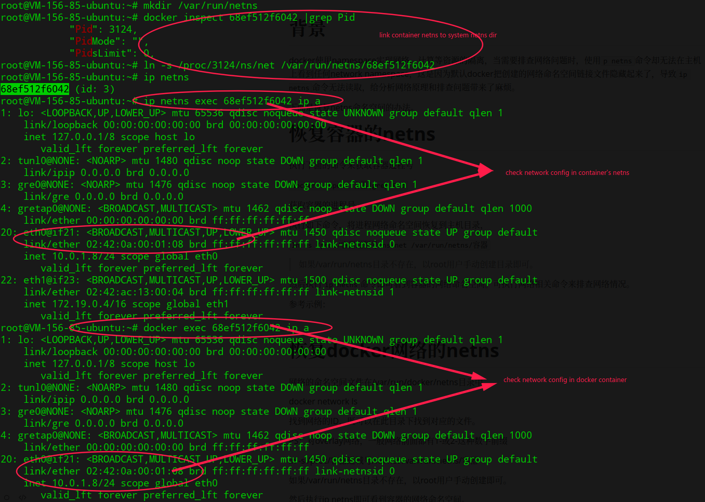
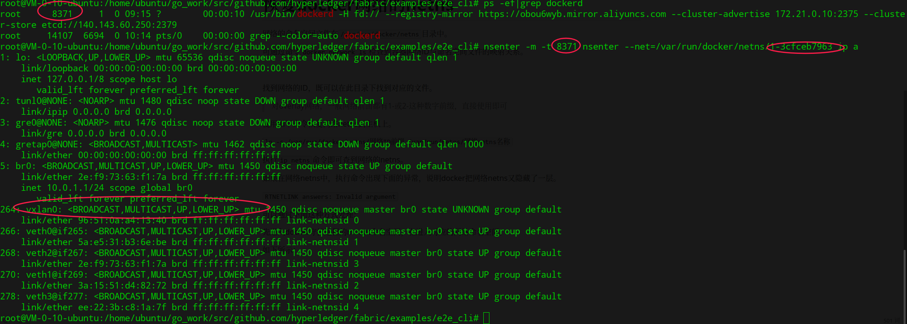

# 背景

docker使用namespace实现网络，计算等资源的隔离，当需要排查网络问题时，使用`p netns`命令却无法在主机上看到任何network namespace，这是因为默认docker把创建的网络命名空间链接文件隐藏起来了，导致`ip netns`命令无法读取，给分析网络原理和排查问题带来了麻烦。

下面是恢复netns命名空间的办法。

#恢复容器的netns

执行下面的命令来获取容器进程号

`docker inspect 容器|grep Pid`

获取容器的进程号

执行如下命令，将进程网络命名空间恢复到主机目录，

`ln -s /proc/容器进程号/ns/net /var/run/netns/容器`

> 如果/var/run/netns目录不存在，以root用户手动创建目录即可。

然后执行`ip netns`命令即可看到容器的网络命名空间。可执行网络相关命令来排查网络情况。

参考示例，从中可以看出确实正常进入了容器的netns：

#恢复docker网络的netns

网络的命名空间文件在`/var/run/docker/netns`目录中。

可通过命令`docker network ls`检查到容器网络ID与命名空间文件的映射关系。

找到网络的ID，既可以在此目录下找到对应的文件。

> 对overlay网络，一般网络前面都有1-或2-这种数字前缀，直接使用即可

使用如下命令恢复网络netns到主机上。

`ln -s /var/run/docker/netns/网络ID前缀 /var/run/netns/网络netns名称`

执行`ip netns`命令即可查到网络的netns。

如果在网络netns中，执行命令出现下面的异常，说明docker把网络netns又隐藏了一层。

`RTNETLINK answers: Invalid argument`

可以先进入docker守护进程的mount命名空间，在进入对应的网络命名空间，执行下面的nsenter命令。

> 这是因为在systemd管理的docker服务中，默认开启了MountFlags=slave，这样容器docker在启动守护进程时，会将守护进程的mount命名空间独立出去，导致系统进程无法查看到，需要进行手动恢复。
>
> 权限足够时，可以删除MountFlags=slave配置。

如下所示：

