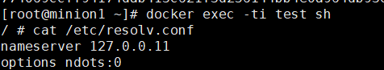
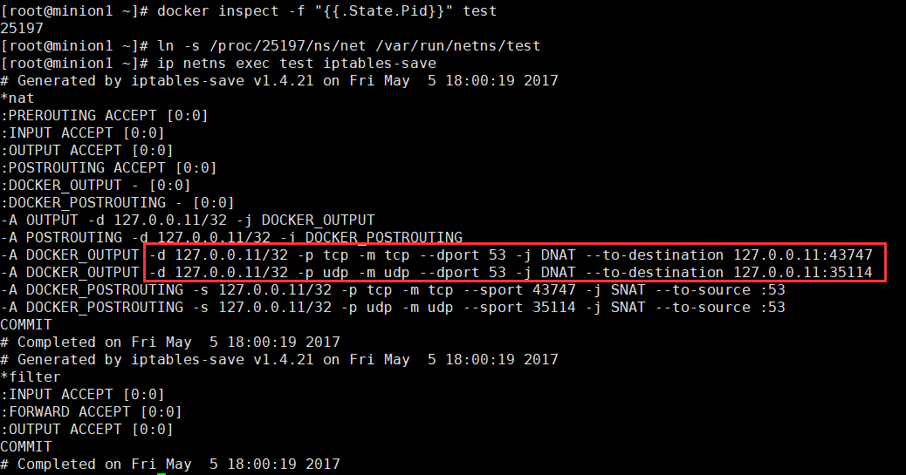
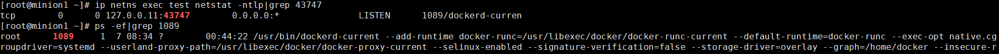

# 环境

测试环境为docker社区版本17.03。

> docker容器的网络命名空间默认无法通过ip netns命令查询到，因此有两种办法。都需要通过`docker inspect -f "{{.State.Pid}}" <container_id>`找到容器的初始进程开始。
>
> 1. 通过`ln -s /proc/<pid>/ns/net /var/run/ns/<container_id>`，将命名空间暴漏在ip netns下，继续后续操作。本文就采用这种办法，好处就是可以利用容器中没有而主机上有的命令行。
> 2. 通过`nsenter –target <pid> –mount –uts –ipc –net –pid`进入容器命名空间，再执行操作。

# 原理介绍

## 容器的dns解析顺序

容器中的DNS名称解析优先级顺序为：

- ​    内置DNS服务器127.0.0.11。
- ​    通过--dns等参数为容器配置的DNS服务器。
- ​    docker守护进程的--dns服务配置（默认为8.8.8.8和8.8.4.4）
- ​    宿主机上的DNS设置。

## docker dns server工作机制

1. 一般情况下，使用docker网络的容器的dns服务器是127.0.0.11。如下图所示：

   

2. 直接在容器中，或者在容器命令空间中，通过`iptables-save`获得iptables规则。如下图所示：

   

   根据iptables规则，可以发现到127.0.0.11的53端口的dns请求，被转发到了43747端口。那么这个端口是被什么程序监听的呢？

3. 在容器的网络命令空间中，可以通过命令`netstat -ntlp`查到监听这个端口的程序，如下图所示：

   

   可以看到dns请求被转发到了主机上的docker containerd进程上了，它会向内部存储做查询，返回dns的查询结果。

   > 如果容器中有netstat命令行，由于进程空间隔离的原因，直接在容器中查询监听端口时，会出现对应进程为-的输出，只能在主机上执行才可以。