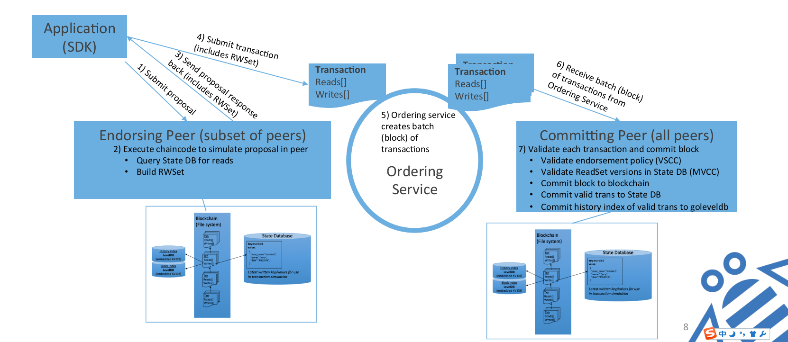
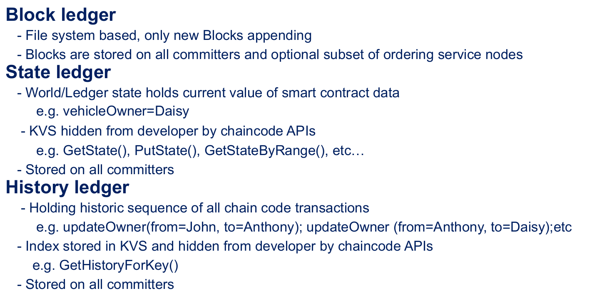
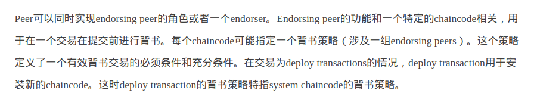
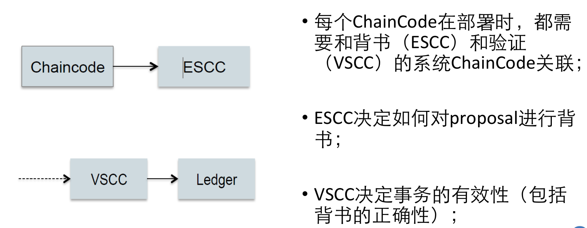
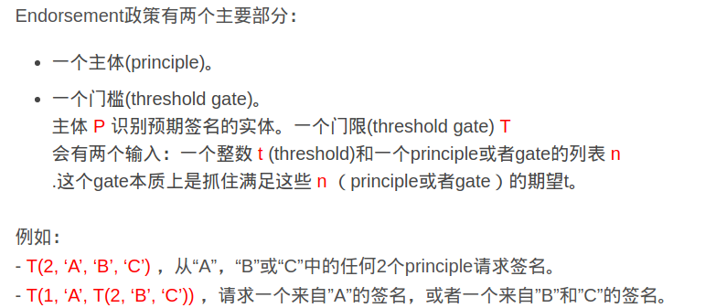
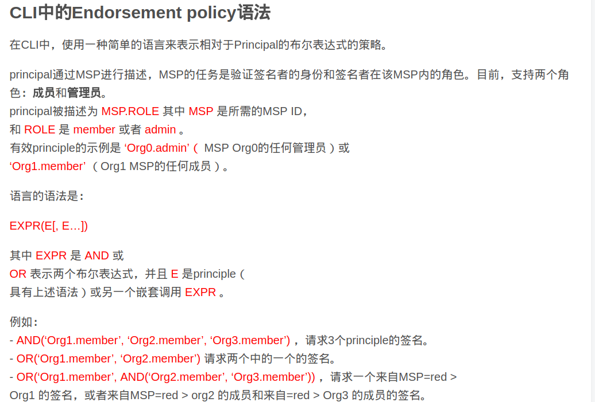

#五种系统chaincode说明

系统chaincode与peer进程存在于一个进程，不想用户chaincode一样，通过docker容器运行。

> 系统chainocode的调用方式与用户chaincode方式调用方式完全一致，都通过下面的方式调用
>
> 

## cscc：configuration system chaincode

系统配置有关的chaincode，例如peer加入channel时，等系统操作由cscc来控制。提供下面几个接口：

> JoinChain：
>
> GetConfigBlock：
>
> GetChannels：

#escc：endorser system chaincode

背书用的chaincode

## vscc：validator system chaincode

验证用的chaincode。

## lscc：lifecycle system chaincode

管理用户chaincode在peer上的部署和实例化。提供下面几个接口。

> install：
>
> deploy：
>
> upgrade：
>
> getid：
>
> getdepspec：
>
> getccdata：查询chaincode信息
>
> getchaincodes：
>
> getinstalledchaincodes：

##qscc：querier system chaincode

查询区块链数据的chaincode。提供下面几个接口。

> GetChainInfo: 查询区块链信息。
>
> GetBlockByNumber：按ID查询区块。
>
> GetBlockByHash：按hash查询区块。
>
> GetTransactionByID：按ID查询事务。
>
> GetBlockByTxID：按事务ID查询区块。

# 不是系统chaincode的mvcc

# 成员管理

##membership service provider（MSP）

成员管理服务实现接口，提供抽象能力，允许在更换MSP情况下，保证核心区块交易不受影响。

为应用客户端和peer提供认证凭据。

客户端使用认证凭据来验证发起区块事务。peer使用认证凭据来验证区块事务是否有效（即执行背书策略，背书）。

## membership service

基于PKI证书的MSP实现，提供区块链网络中的认证、授权和身份管理。

## member

网络中持有***唯一***根证书的法律实体。

成员在每个channel上，都可以有若干个peer，这些peer可能是anchor peer、leader peer。应用的客户端也必须绑定到member才能执行。

> 目前，member支持有两种角色，admin和member。

## enrollment

用户如何注册

> 管理员：
>
> 普通用户：

## CA server

# ordering service

预先定义好的一批节点，这些节点对区块事务排序。处理数据时，按FIFO的方式进行。

提供solo模式和基于kafka的集群模式。独立于peer处理流程

> ordering service存在于整个网络中，并持有所有成员的身份数据（以加密方式）。

# 节点类型

## peer node

维护账本的网络实体，通过运行chaincode容器对账本进行读写操作。运行peer node时，必须持有MSP的member身份。

### endorsing peer

背书节点，为peer node提交的请求进行背书。属于peer节点的子集，

### anchor peer

锚点节点，channel中的**所有**其他peer都可发现并通信的一类peer（i.e.，存在只能跟锚点peer通信的peer）。channel上的每个成员必须有一个（或者若干个锚点节点来规避单点故障），这样才能使不同成员的peer发现channel中的所有peer。

> 锚点peer在创建组织/member时指定，因此必须能够与channel中的所有peer通信。

### leader peer

代表channel中其他所有peer与orderer peers组成的网络进行交互的peer，ordering peer将区块事务发送给leader peer，然后leader peer再通过gossip协议分发给channel中的其他peer。

> 可在peer启动时，指定自身是否为leader peer。如果指定，则必须能够与
>
> leader peer通过gossip协议，在能够与ordering service通信的节点之间选举出来。

##ordering node

排序节点，将事务请求处理序列化为对区块链的读写操作，提交到peer节点上，最终保存在区块链上。

## application client

应用客户端，需要能够访问endoring peer来对请求进行背书，然后能够访问ordering node来提交区块事务到区块链中。

> client可能与任何peer通信，因此理论上应当可以与所有机构中的不同peer进行通信。
>
> client必须能够与ordering node通信

# 数据类型

##ledger

存储在文件系统上的账本，peer从ordering peer接收区块交易，将区块追加到本地的chain中。

> 包括区块链和current state两类数据，由channel中的所有peer负责进行维护。

## current state

区块链中，所有key的最新value，被称为当前状态，亦即world state。chaincode总是基于current state，准备区块交易。

> 存储在leveldb或者couchdb中，

## 历史数据库

# chaincode操作

## initialize

初始化chaincode的操作，设置chaincode运行所需要的初始化环境。upgrade时，也会进行intialize。

## install

在peer节点上安装chaincode的操作。

## instantiate

实例化chaincode。启动chaincode进程并初始化chaincode，peer就可以响应chaincode的特定操作了。

## invoke

调用chaincode执行特定操作。格式为调用的函数名以及对应的参数列表。

# 策略

背书、验证、chaincode、网络/channel管理都有不同的策略

#其他术语

## chain

链是区块交易的日志记录，区块间通过hash产生链接关联。peer从ordering peer接收区块交易，校验区块的合法性后，把区块追加到peer的文件系统上。

## channel

channel是局部私有的区块链，被channel中的所有peer共享，对此ledger的操作需要一定的授权。通过configuration block配置产生。

- Hyperledger Fabric 通道是两个或多个特定网络成员之间的通信的私有“子网”，用于进行需要数据保密的交易。channel由成员（组织）、每个成员的锚点、共享账本，链码应用程序和order服务节点定义。网络上的每个transaction都在一个channel上执行，每个通信方必须经过身份验证并授权在该channel上进行交易。加入channel的每个peer都具有由成员服务提供商（MSP）给出的自己的身份。
- 要创建新的channel，客户端SDK会调用configuration system chaincode和引用属性，如锚点和成员（组织）。该请求为channel ledger创建一个genesis block，它存储有关channel策略，成员和锚点的配置信息。当将新成员添加到现有channel时，这个genesis block或最近被重新配置的块将会分享给新成员。（具体可参阅configtx部分）
- channel中每个成员的leading peer的选举决定了哪个peer代表成员与ordering service进行通信。如果没有指定leader，则可以使用算法来指定leader。共识服务将交易排序并以一个block的形式发送给一个leader，然后leader将其分发给其成员 peer，并用gossip 协议进行跨channel通信。
- 虽然任何一个锚点可以属于多个信道，并且因此维护多个账本，但没有账本数据可以从一个channel传递到另一个channel。ledger按channel分隔，由configuration chaincode，identity membership service和gossip数据传播协议来定义和实现。被隔离的数据包括交易信息，账本状态和channel成员资料，这些数据仅限于在channel上具有可验证成员资格的peer间传播。通过信道隔离peer和账本数据，允许需要私有和机密事务的网络成员与同一个块链网络上的业务竞争对手和其他受限制的成员共存。

## configuration block

对成员、order策略、channel的操作产生的配置块。初始化区块链网络或者channel的配置区块，成为创世块genesis block。

## commitment

channel中的peer检验ordering peer排序后的区块交易有效性，并追加到channel私有的ledger上

##endorsing policy

背书策略，客户端告诉endorsing peer节点，怎么确认的区块事务是否有效的方法。执行chaincode时，可以指定对应的背书策略。亦即执行特定chaincode时，必须同时执行的区块交易。

# system chain

系统链，包含系统级的整个网络配置，存在于ordering service的个节点组成的channel中，任何系统级的变更（组织的加入/离开、orderer节点的加入）都会在系统链上产生新的配置块。