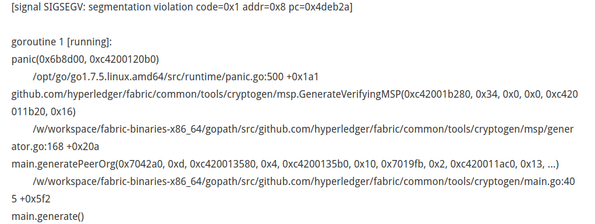
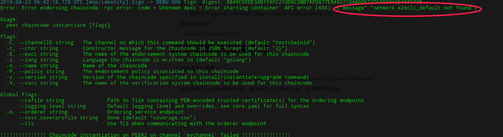
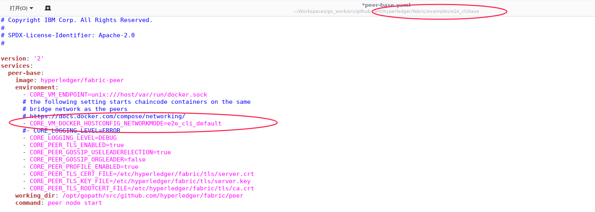

#准备开发环境

1. 参考官方文档，安装docker、docker-compose、go、git等依赖软件

# 准备测试环境

1. 在GOPATH下创建对应目录

   `mkdir -p $GOPATH/github.com/hyperledger`

2. 下载代码

   `git clone https://github.com/hyperledger/fabric.git `

   > 默认checkout的是最新的代码，需要手动切换到release-1.0分支
   >
   > git checkout release-1.0

3. 测试e2e示例

   `cd $GOPATH/github.com/hyperledger/fabric/examples/e2e_cli`

   启动测试环境

   `./network_setup.sh up`

#示例问题与解决办法

1. 如果启动时报错

   

   可能是由于go语言版本的问题，重新安装1.9.5版本的go，此问题不再出现。

   ​

2. 启动chaincode时报错，

   

   通过对比`docker network ls`的结果，发现对应网络名称应当为`e2e_cli_default`，修改peer-base.yaml配置为对应网络即可。

   

3. ​