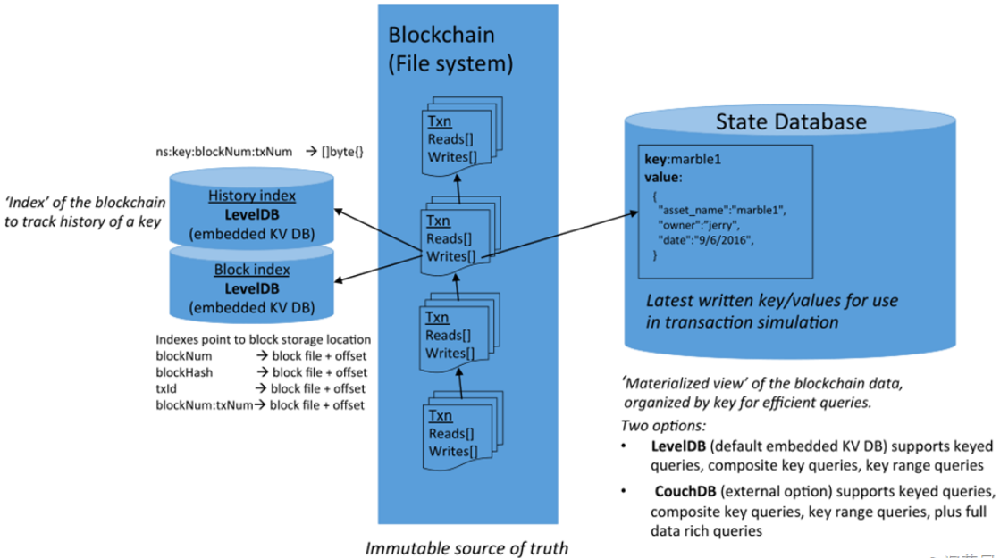
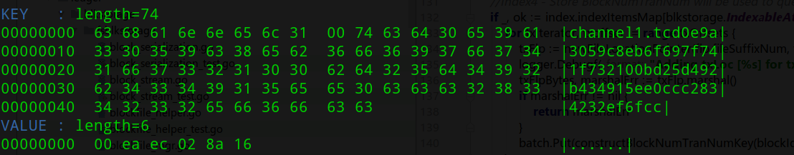
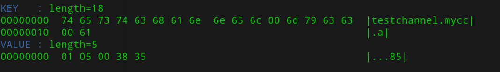
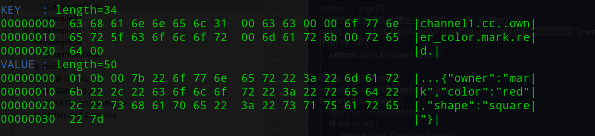
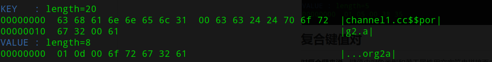
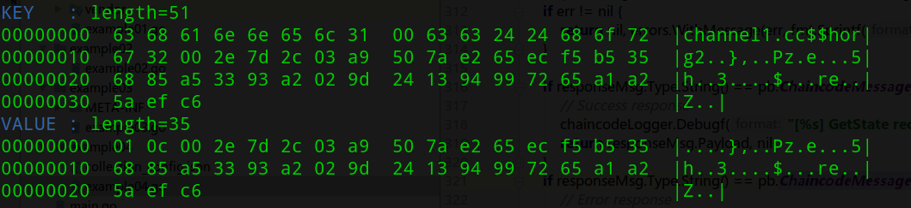

# 账本逻辑结构

账本逻辑结构如下图所示：



- history index：用于支持按key查询其数据历史，保存区块时，自动刷新；
- block index：区块索引，用于按区块编号、交易ID等信息，查询区块在文件系统中的偏移量、大小等信息的数据库，保存区块时，自动刷新
- state database：保存当前key，value最新值的数据库，节点背书时，根据state database中的值进行背书。

- 每个区块包含若干交易，根据交易，交易中包含读写集，包含对key的读取和写入信息，最终更新到文件系统中的区块上，和state database中。

# 账本物理结构

在peer节点上，账本以目录形式存在，其结构示例如下：

```shell
.
├── chains
│   ├── chains
│   │   └── channel1
│   │       └── blockfile_000000
│   └── index
│       ├── 000001.log
│       ├── CURRENT
│       ├── LOCK
│       ├── LOG
│       └── MANIFEST-000000
├── historyLeveldb
│   ├── 000001.log
│   ├── CURRENT
│   ├── LOCK
│   ├── LOG
│   └── MANIFEST-000000
├── ledgerProvider
│   ├── 000001.log
│   ├── CURRENT
│   ├── LOCK
│   ├── LOG
│   └── MANIFEST-000000
├── pvtdataStore
│   ├── 000001.log
│   ├── CURRENT
│   ├── LOCK
│   ├── LOG
│   └── MANIFEST-000000
└── stateLeveldb
    ├── 000001.log
    ├── CURRENT
    ├── LOCK
    ├── LOG
    └── MANIFEST-000000
```

- chains目录为原始账本和账本的索引数据库
- historyLeveldb目录为key的历史数据索引数据库，只能是leveldb
- ledgerProvider目录为peer已加入的通道列表的数据库，只能是leveldb
- pvtdataStore目录为private collection data的明文值的数据库，只能是leveldb
- stateLeveldb目录为当前状态的数据库，可以选择内置的leveldb或者使用外置的couchdb

## 原始账本

原始账本使用文件进行存储，fabric也直接使用标准库来操作读写文件，区块按文件存储在文件中。区块文件以blockfile_XXXXXX的方式，依次递增。

每个通道都有单独的账本文件路径，但共享同一个索引数据库。

### index db

由于区块的原始记录在文件中，查询时如果遍历区块文件，效率会很低，因此fabric默认提供了基于leveldb的索引数据库，可以根据区块查到对应的区块所在的区块文件和索引位置。目前fabric提供根据下列属性查询区块文件位置的索引：

```shell
blockHash-------->(区块文件后缀编号,区块数据开始偏移量,区块数据字节长度)
blockNum--------->(区块文件后缀编号,区块数据开始偏移量,区块数据字节长度)
txId---------->(区块文件后缀编号,交易数据开始偏移量,交易数据字节长度)
#用于查询key历史的的索引
blockNumTxNo----->(区块文件后缀编号,交易数据开始偏移量,交易数据字节长度)
txId--------->(区块文件后缀编号,区块数据开始偏移量,区块数据字节长度)
txId--------->(交易验证结果，是否有效)
```

不同的索引，在索引数据库中以前缀字母区分，代码片段

```go
blockNumIdxKeyPrefix           = 'n'
blockHashIdxKeyPrefix          = 'h'
txIDIdxKeyPrefix               = 't'
blockNumTranNumIdxKeyPrefix    = 'a'
blockTxIDIdxKeyPrefix          = 'b'
txValidationResultIdxKeyPrefix = 'v'
```

某个交易ID对应数据记录的值如下，格式为`<channel_name>.<prefix><key>`：



## state db

state db在节点上用于保存当前状态（key/value键值对），提供了一个便于使用并且响应快速的访问数据的途径。**同时，peer节点在背书时，也是根据statedb中的值来进行背书的**。state db中的数据，可以根据原始账本推算出来。

>**问题**：如果state db被修改，fabric会不会自动通过定期对账的方式来检查出异常？

默认使用leveldb，可以通过配置启用为couchdb。core.ledger.state.stateDatabase等一系列进行修改。

本文以leveldb为例，介绍存储在数据库中的数据格式，有助于理解fabric的结构。

### 简单键值对

实际上在state leveldb和history leveldb中，都是以**<channel_name>.<chain_code_name>.<real_key>**方式存储，如下所示：



### 复合键值对

**对复合键来说**，键值由对象类型和若干属性用空字符串拼接而成，如下图所示，但依然按照**<channel_name>.<chain_code_name>.<real_key>**的方式存储

复合键存储的数据



### private collection data的键值对

对可以访问数据的节点，存储数据格式为<channel_name>.<chain_code_name>$$<collection_name>.<real_key>



对无法访问数据的节点，存储数据格式key和value都是hash后的值



## history level db

为了便于对key的历史记录进行查询，peer提供了基于leveldb的history level db数据库。

- 不支持使用其他类型数据库
- 可以通过配置`core.ledger.history.enableHistoryDatabase=false`来关闭

在history leveldb数据库中，将`通道名称`、`合约名称`、`key`、区块编号、交易No的方式（仅针对有效交易），生成复合key，查询时，按`通道名称`、`合约名称`、`key`生成部分复合key，然后做查询，需要遍历结果时，则根据区块编号和交易编号，读取对应区块，获取到对应值。某一行的记录如下所示：


- 

