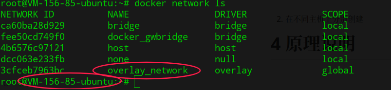
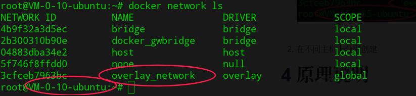
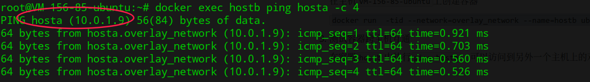
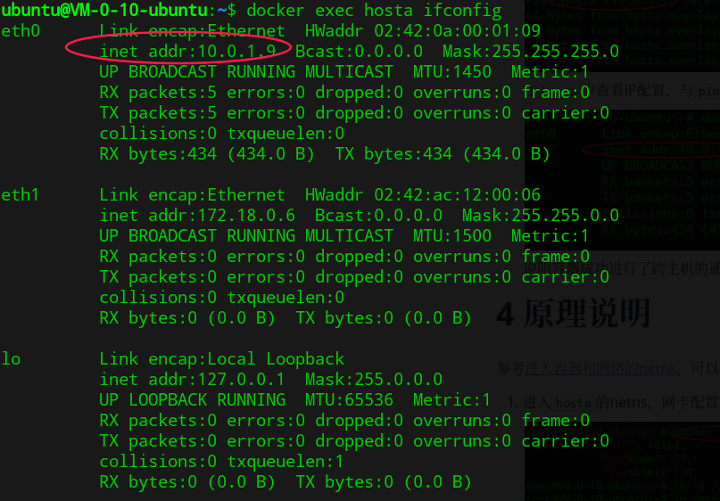
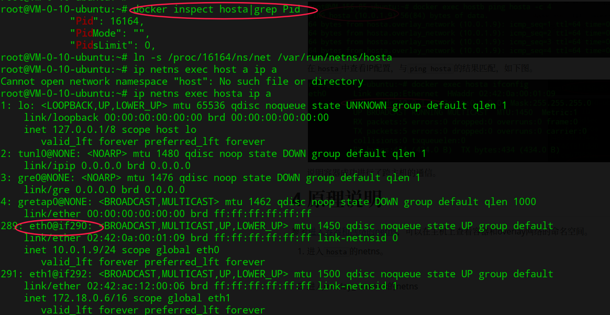
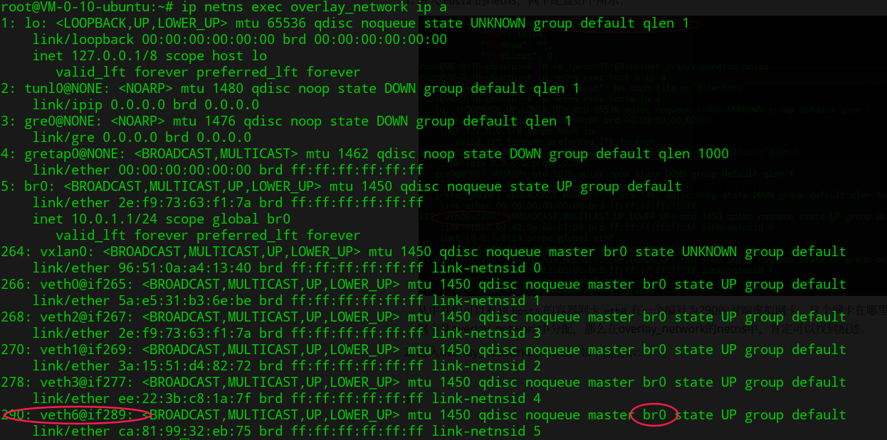
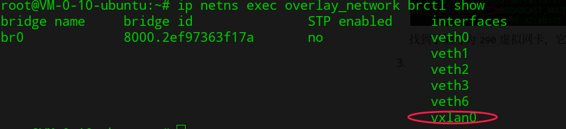
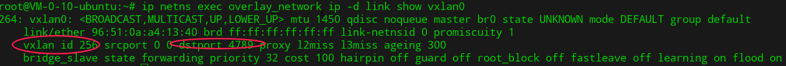
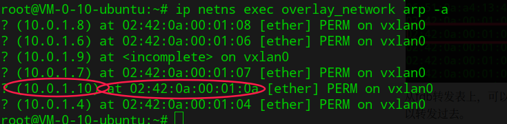
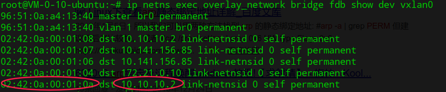

# 1 简介

docker从1.9版本以后就自带了基于vxlan的overlay网络能力，使docker从原生基础设施上满足了大部分容器跨主机通信的需求。

# 2 前提

使用原生overlay网络功能需要满足以下条件（以目前最新版本18.04为例）：

- 所有主机内核版本在3.10及以上

- key/value存储服务

  两种方式择其一即可。

  - 使用外部存储服务，目前支持consul、etcdv2、zookeeper，要求所有主机都可以访问此服务；
  - 启用swarm模式，由docker自身提供key/value存储能力，所有主机互通即可。

- 主机之间网络互通，需要打开以下端口：

  - 2375：TCP端口，主机之间的API交互端口，这个可以自定义。
  - 7946：TCP、UDP端口，主机之间的数据交互，用于生成overlay的转发表。
  - 4789：UDP端口，overlay网络的vxlan数据通信端口

# 3 功能测试

1. 按照前提准备好docker服务后，创建overlay测试网络。

   在任意主机上执行下列命令

   `docker network create --driver overlay overlay_network`

   由于主机之间已经通过建立共享存储，在任意其他主机上执行`docker network ls`都可以查询到此网络。产生类似下面的输出。

   

   

2. 在不同主机上分别创建`overlay_network`下的容器。

   在主机`VM-0-10-ubuntu`上创建容器

   `docker run  -tid --network=overlay_network --name=hosta ubuntu:14.04 sleep 3600`

   在主机`VM-156-85-ubuntu`上创建容器

   `docker run  -tid --network=overlay_network --name=hostb ubuntu:14.04 sleep 3600`

3. 测试容器跨主机互通

   在容器`hostb`中执行`ping hosta`，可以访问到另外一个主机上的对应容器，如下图。

   

   在`hosta`中查看IP配置，与`ping hosta`的结果匹配，如下图。

   

   > eth1是docker为容器默认添加的dockergw_bridge上的虚拟网卡，用于实现主机与容器之间的通信。

   说明容器成功进行了跨主机的通信。

# 4 原理说明

参考[进入容器和网络的netns](./check_container_netns_on_host.md)，可以在主机上查看容器和overlay网络的命名空间。

1. 进入`hosta`的netns，网卡配置如下所示：

   

   从中我们可以看到`hosta`的容器网卡`eth0`有一个编号为`290`的对端虚拟网卡，这个网卡在哪里呢？`hosta`的网卡从`overlay_network`中分配，那么在`overlay_network`的netns中，肯定可以找到痕迹。

2. 进入overlay_network的netns，检查网卡配置，如下图所示：

   

   找到了编号为`290`虚拟网卡，它在一个网桥`br0`上，使用命令`brctl show`检查网桥配置，如下所示。

   

   从overlay网络实现原理，我们知道它是基于vxlan实现的，那么这个虚拟网卡`vxlan0`就是实现跨主机通信的关键所在。

3. 检查`vxlan0`网卡的配置，可使用命令`ip -d link show vxlan0`

   

   可见vxlan隧道ID分配为`256`，数据通信端口为`4789`。

   在`overlay_network`的netns中，我们检查arp表，可见若干条静态的映射，这是由docker守护进程生成的，通信时，根据ARP表来找到对应mac地址，如下图所示。

   

   得到mac地址后，可以在fdb表中，找到下一跳对应的主机地址。

   使用命令`bridge fdb show dev vxlan0`，可以检查vxlan0上的fdb转发表规则。

   

   从fdb转发表上，可以看到对端容器的mac地址和要转发的对应主机IP地址，这样整个通信链路就打通了，可以转发到对端主机上，对端主机收到数据后，再通过其上的`overlay_network`的netns，将数据转发到对应容器上。

   > 上图中，对端地址之所以时10.10.10.2，是因为两个主机是通过gre隧道打通的，此地址为gre隧道对端地址。

   ​

   至此，我们了解清楚了docker overlay网络的实现原理，有助于以后的容器网络故障分析排查。

   ​