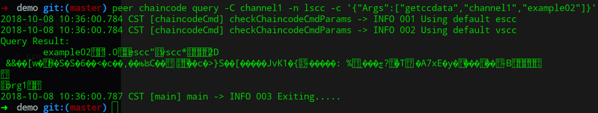
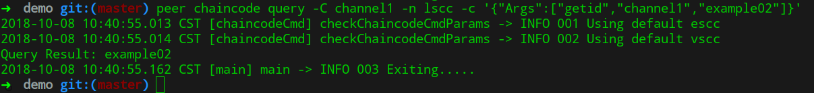
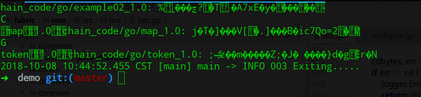
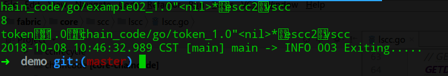
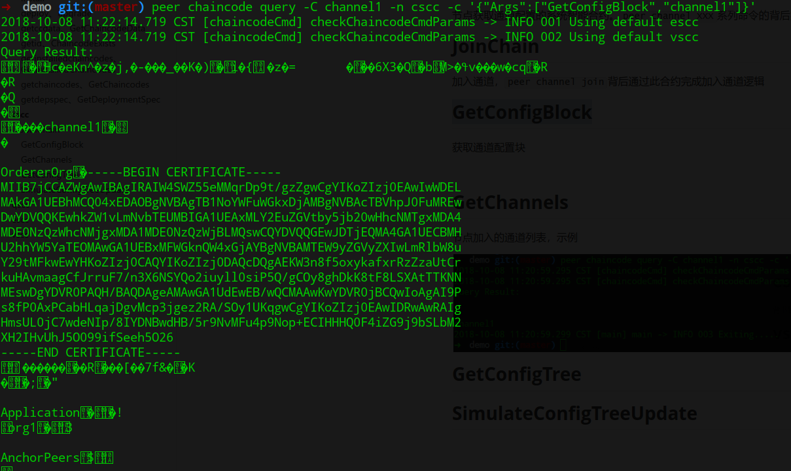
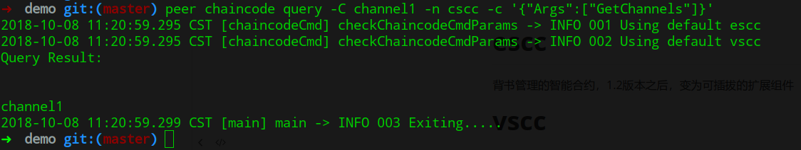
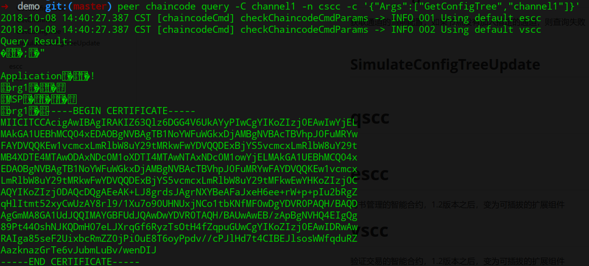

系统智能合约都内嵌在peer进程中，不需要单独的容器。

# lscc

peer节点使用lscc来管理智能合约的整个生命周期。`peer chaincode XXX`命令行背后的实现

## install

安装智能合约，无需通知orderer服务。必须是组织的管理员才能操作

> 在peer的msp的admincerts中的证书签名

## deploy、upgrade

初始化智能合约

## getccdata、GetChaincodeData

获取**已经初始化**的合约信息，如果合约未被初始化，将产生异常。示例：



响应结果需要使用protobuf处理才能正常读取，参考社区示例解析代码，可以解析出合约的初始化策略

```go
//fabric-sdk-go/pkg/client/common/selection/dynamicselection/ccpolicyprovider.go
func (dp *ccPolicyProvider) GetChaincodePolicy(chaincodeID string) (*common.SignaturePolicyEnvelope, error) {
	if chaincodeID == "" {
		return nil, errors.New("Must provide chaincode ID")
	}

	key := newResolverKey(dp.channelID, chaincodeID)
	var ccData *ccprovider.ChaincodeData

	dp.mutex.RLock()
	ccData = dp.ccDataMap[chaincodeID]
	dp.mutex.RUnlock()
	if ccData != nil {
		return unmarshalPolicy(ccData.Policy)
	}

	dp.mutex.Lock()
	defer dp.mutex.Unlock()

	response, err := dp.queryChaincode("lscc", "getccdata", [][]byte{[]byte(dp.channelID), []byte(chaincodeID)})
	if err != nil {
		return nil, errors.WithMessage(err, fmt.Sprintf("error querying chaincode data for chaincode [%s] on channel [%s]", chaincodeID, dp.channelID))
	}

	ccData = &ccprovider.ChaincodeData{}
	err = proto.Unmarshal(response, ccData)
	if err != nil {
		return nil, errors.WithMessage(err, "Error unmarshalling chaincode data")
	}

	dp.ccDataMap[key.String()] = ccData

	return unmarshalPolicy(ccData.Policy)
}
```

## getid、ChaincodeExists

合约是否已经初始化，如果未初始化，将产生异常



## getinstalledchaincodes、GetInstalledChaincodes

节点上安装的智能合约列表，结果需要使用protobuf进行解析



响应结果解析代码示例

```go
//fabric/peer/chaincode/list.go
func getChaincodes(cmd *cobra.Command, cf *ChaincodeCmdFactory) error {
	if getInstantiatedChaincodes && channelID == "" {
		return errors.New("The required parameter 'channelID' is empty. Rerun the command with -C flag")
	}
	// Parsing of the command line is done so silence cmd usage
	cmd.SilenceUsage = true

	var err error
	if cf == nil {
		cf, err = InitCmdFactory(cmd.Name(), true, false)
		if err != nil {
			return err
		}
	}

	creator, err := cf.Signer.Serialize()
	if err != nil {
		return fmt.Errorf("Error serializing identity for %s: %s", cf.Signer.GetIdentifier(), err)
	}

	var prop *pb.Proposal
	if getInstalledChaincodes && (!getInstantiatedChaincodes) {
		prop, _, err = utils.CreateGetInstalledChaincodesProposal(creator)
	} else if getInstantiatedChaincodes && (!getInstalledChaincodes) {
		prop, _, err = utils.CreateGetChaincodesProposal(channelID, creator)
	} else {
		return fmt.Errorf("Must explicitly specify \"--installed\" or \"--instantiated\"")
	}

	if err != nil {
		return fmt.Errorf("Error creating proposal %s: %s", chainFuncName, err)
	}

	var signedProp *pb.SignedProposal
	signedProp, err = utils.GetSignedProposal(prop, cf.Signer)
	if err != nil {
		return fmt.Errorf("Error creating signed proposal  %s: %s", chainFuncName, err)
	}

	// list is currently only supported for one peer
	proposalResponse, err := cf.EndorserClients[0].ProcessProposal(context.Background(), signedProp)
	if err != nil {
		return errors.Errorf("Error endorsing %s: %s", chainFuncName, err)
	}

	if proposalResponse.Response == nil {
		return errors.Errorf("Proposal response had nil 'response'")
	}

	if proposalResponse.Response.Status != int32(cb.Status_SUCCESS) {
		return errors.Errorf("Bad response: %d - %s", proposalResponse.Response.Status, proposalResponse.Response.Message)
	}

    //解析响应结果
	cqr := &pb.ChaincodeQueryResponse{}
	err = proto.Unmarshal(proposalResponse.Response.Payload, cqr)
	if err != nil {
		return err
	}

	if getInstalledChaincodes {
		fmt.Println("Get installed chaincodes on peer:")
	} else {
		fmt.Printf("Get instantiated chaincodes on channel %s:\n", channelID)
	}
	for _, chaincode := range cqr.Chaincodes {
		fmt.Printf("%v\n", ccInfo{chaincode}.String())
	}
	return nil
}
```


## getchaincodes、GetChaincodes

查询通道中已经实例化的合约列表，需要使用protobuf解析。



解析代码示例参考安装合约的解析。

## getdepspec、GetDeploymentSpec

**初始化合约**的部署spec，包括语言、合约名称、初始化参数信息。

结果需要使用protobuf解析，示例代码

```go
//fabric/core/chaincode/lifecycle_test.go
Describe("GetChaincodeDeploymentSpec", func() {
		var deploymentSpec *pb.ChaincodeDeploymentSpec

		BeforeEach(func() {
			chaincodeID := &pb.ChaincodeID{Name: "chaincode-name", Version: "chaincode-version"}
			deploymentSpec = &pb.ChaincodeDeploymentSpec{
				CodePackage:   []byte("code-package"),
				ChaincodeSpec: &pb.ChaincodeSpec{ChaincodeId: chaincodeID},
			}
			deploymentSpecPayload, err := proto.Marshal(deploymentSpec)
			Expect(err).NotTo(HaveOccurred())

			response := &pb.Response{Status: shim.OK, Payload: deploymentSpecPayload}
			fakeExecutor.ExecuteReturns(response, nil, nil)
		})

		It("invokes lscc getdepspec with the correct args", func() {
			cds, err := lifecycle.GetChaincodeDeploymentSpec(context.Background(), "tx-id", signedProp, proposal, "chain-id", "chaincode-id")
			Expect(err).NotTo(HaveOccurred())
			Expect(cds).To(Equal(deploymentSpec))

			Expect(fakeExecutor.ExecuteCallCount()).To(Equal(1))
			ctx, cccid, cis := fakeExecutor.ExecuteArgsForCall(0)
			Expect(ctx).To(Equal(context.Background()))
			Expect(cccid).To(Equal(ccprovider.NewCCContext("chain-id", "lscc", "latest", "tx-id", true, signedProp, proposal)))
			Expect(cis).To(Equal(&pb.ChaincodeInvocationSpec{
				ChaincodeSpec: &pb.ChaincodeSpec{
					Type:        pb.ChaincodeSpec_GOLANG,
					ChaincodeId: &pb.ChaincodeID{Name: "lscc"},
					Input: &pb.ChaincodeInput{
						Args: util.ToChaincodeArgs("getdepspec", "chain-id", "chaincode-id"),
					},
				},
			}))
		})
```

# cscc

节点获取通道配置的系统智能合约。`peer channel XXX`系列命令的背后实现

## JoinChain

加入通道，`peer channel join`背后通过此合约完成加入通道逻辑

## GetConfigBlock

获取通道配置块内容，输出为protobuf格式。



需要使用protobuf解析为对象，示例代码

```go
// fabric/peer/common/common.go
// GetOrdererEndpointOfChain returns orderer endpoints of given chain
func GetOrdererEndpointOfChain(chainID string, signer msp.SigningIdentity, endorserClient pb.EndorserClient) ([]string, error) {
	// query cscc for chain config block
	invocation := &pb.ChaincodeInvocationSpec{
		ChaincodeSpec: &pb.ChaincodeSpec{
			Type:        pb.ChaincodeSpec_Type(pb.ChaincodeSpec_Type_value["GOLANG"]),
			ChaincodeId: &pb.ChaincodeID{Name: "cscc"},
			Input:       &pb.ChaincodeInput{Args: [][]byte{[]byte(cscc.GetConfigBlock), []byte(chainID)}},
		},
	}

	creator, err := signer.Serialize()
	if err != nil {
		return nil, errors.WithMessage(err, fmt.Sprintf("error serializing identity for %s", signer.GetIdentifier()))
	}

	prop, _, err := putils.CreateProposalFromCIS(pcommon.HeaderType_CONFIG, "", invocation, creator)
	if err != nil {
		return nil, errors.WithMessage(err, "error creating GetConfigBlock proposal")
	}

	signedProp, err := putils.GetSignedProposal(prop, signer)
	if err != nil {
		return nil, errors.WithMessage(err, "error creating signed GetConfigBlock proposal")
	}

	proposalResp, err := endorserClient.ProcessProposal(context.Background(), signedProp)
	if err != nil {
		return nil, errors.WithMessage(err, "error endorsing GetConfigBlock")
	}

	if proposalResp == nil {
		return nil, errors.WithMessage(err, "error nil proposal response")
	}

	if proposalResp.Response.Status != 0 && proposalResp.Response.Status != 200 {
		return nil, errors.Errorf("error bad proposal response %d: %s", proposalResp.Response.Status, proposalResp.Response.Message)
	}

	// parse config block
	block, err := putils.GetBlockFromBlockBytes(proposalResp.Response.Payload)
	if err != nil {
		return nil, errors.WithMessage(err, "error unmarshaling config block")
	}

	envelopeConfig, err := putils.ExtractEnvelope(block, 0)
	if err != nil {
		return nil, errors.WithMessage(err, "error extracting config block envelope")
	}
    //解析配置响应
	bundle, err := channelconfig.NewBundleFromEnvelope(envelopeConfig)
	if err != nil {
		return nil, errors.WithMessage(err, "error loading config block")
	}

	return bundle.ChannelConfig().OrdererAddresses(), nil
}

```


## GetChannels

节点加入的通道列表，示例



## GetConfigTree

获取通道的当前配置，如果节点没有加入指定的通道，则查询失败



## SimulateConfigTreeUpdate

根据通道当前配置，生成update数据格式。

# qscc

查询通道、区块和交易信息。

## GetChainInfo

查询通道中的区块信息，包括区块高度等信息

## GetBlockByNumber

查询区块，查询

## GetBlockByHash

按hash查询区块

## GetTransactionByID

按交易ID查询交易

## GetBlockByTxID

按交易ID查询区块

# escc

背书交易请求的智能合约。

> 1.2版本之后，变为可插拔的扩展组件。不再使用智能合约实现，`fabric/core/handlers/endorsement`

# vscc

验证交易请求的智能合约，包括检查mvcc并发控制和背书策略的有效性

> 1.2版本之后，变为可插拔的扩展组件。不再使用智能合约实现，fabric/core/handlers/validation`

