fabric社区自带的测试脚本已经非常完善，能够快速搭建一个测试环境出来。但为了了解具体细节，本文章将一步一步地完成环境的搭建过程进行说明，加深对各步骤操作的理解。

# 1.环境准备

参考官方文档，安装准备如下软件

- go 1.7.5版本及以上，尽量不要使用直接安装方式的版本

- docker 1.12版本及以上

- docker-compose 1.14及以上

- make

- 下载fabric源代码，并切换到`release-1.0`分支。设置正确的环境变量。

  ```bash
  export GOPATH=$(pwd)
  mkdir -p $GOPATH/src/github.com/hyperledger
  cd $GOPATH/src/github.com/hyperledger&&git clone https://github.com/hyperledger/fabric.git
  ```


- 预先下载好如下镜像

  > 可通过增加docker配置`--registry-mirror https://obou6wyb.mirror.aliyuncs.com`，使用阿里云镜像仓库加速下载。

  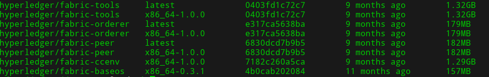

# 2.生成公私钥和证书

> fabric中有两种类型的公私钥和证书，一种是给节点之前通讯安全而准备的TLS证书，另一种是用户登录和权限控制的用户证书。这些证书本来应该是由**fabric CA**服务来颁发，但在测试环境中，我们可以使用fabric提供的cryptogen工具来生成，简化操作。

## 2.1编译cryptogen

使用如下make命令来编译cryptogen程序，注意此程序运行仍然需要以来go环境。

```bash
cd $GOPATH/src/github.com/hyperledger/fabric
make cryptogen
```

输出如下内容，表示编译成功

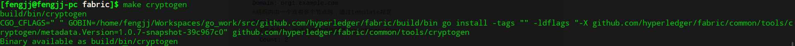

## 2.2配置crypto-config.yaml

配置crypto-config.yaml，此配置文件包含组织信息和order信息，生成所需要的证书。

examples/e2e_cli/crypto-config.yaml默认提供了一个Orderer Org和两个Peer Org的配置，该模板中也对各个字段进行了说明，组织的声明支持两种：

```yaml
OrdererOrgs:
  - Name: Orderer
    Domain: example.com
    #组织内只有一个节点时，通过Specs指定
    Specs:
      #组织内只有一个节点时，指定的主机名
      - Hostname: orderer
PeerOrgs:
  - Name: Org1
    Domain: org1.example.com
    #组织内由一个或者多个节点时，通过template指定
    Template:
      #节点个数，生成的主机名按顺序peer0到peer{Count-1}
      Count: 2
    Users:
      #生成的除Admin之外的普通用户证书个数
      Count: 1
  - Name: Org2
    Domain: org2.example.com
    Template:
      Count: 2
    Users:
      Count: 1
  - Name: Org3
    Domain: org3.example.com
    Template:
      Count: 2
    Users:
      Count: 1
```

Name和Domain即为组织的名称和域名，用于生成证书使用。配置完成crypto-config.yaml后，就可以生成公私钥和证书了。

> 在社区自带例子基础上，增加了一个新的组织。

## 2.2 生成公私钥和证书

使用编译好的cryptogen读取配置的crypto-config.yaml来生成公私钥和证书，命令行如下：

```bash
cd examples/e2e_cli/
../../build/bin/cryptogen generate --config=./crypto-config.yaml
```

命令行输入如下图：

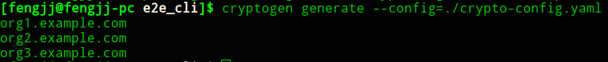

产生的公私钥和证书都存在于crypto-config目录，可以用如下命令来检查生成了哪些证书。

`tree crypto-config`

可以看到类似下面的输出

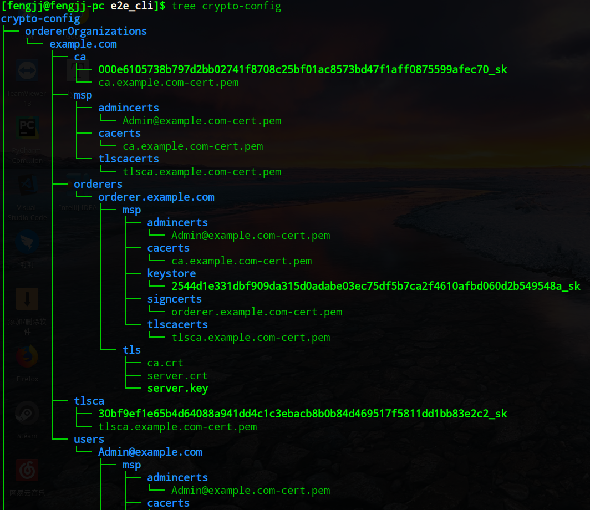

# 3 生成创世块和channel配置

fabric使用configtxgen工具生成以下系统配置：

- 创世块，被ordering service使用
- channel配置信息，创建和配置channel使用。
- 锚点peer信息，创建组织时，指定其中的锚点节点，产生的配置块。

可使用fabric源码直接编译出来。

## 3.1编译configtxgen

使用如下命令编译configtxgen工具

```shell
cd $GOPATH/src/github.com/hyperledger/fabric/
make configtxgen
```

产生如下输出，编译成功。

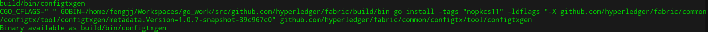

## 3.2配置configtx.yaml

官方例子examples/e2e_cli/configtx.yaml中包含了order的配置和有两组peer组成的channel的配置。order可以配置为solo或者给予kafka的集群模式，测试时可以直接使用默认值即可。对channel的配置，稍作变动，改为三个channel，每个channel有一个组织、两个节点。

实例配置修改为如下：

```yaml
# Copyright IBM Corp. All Rights Reserved.
#
# SPDX-License-Identifier: Apache-2.0
#

---
################################################################################
#
#   Profile
#
#   - Different configuration profiles may be encoded here to be specified
#   as parameters to the configtxgen tool
#
################################################################################
Profiles:

    ThreeOrgsOrdererGenesis:
        Orderer:
            <<: *OrdererDefaults
            Organizations:
                - *OrdererOrg
        Consortiums:
            Consortium1:
                Organizations:
                    - *Org1
            Consortium2:
                Organizations:
                    - *Org2
            Consortium3:
                Organizations:
                    - *Org3
        
    Orgs1Channel:
        Consortium: Consortium1
        Application:
            <<: *ApplicationDefaults
            Organizations:
                - *Org1

    Orgs2Channel:
        Consortium: Consortium2
        Application:
            <<: *ApplicationDefaults
            Organizations:
                - *Org2

    Orgs3Channel:
        Consortium: Consortium3
        Application:
            <<: *ApplicationDefaults
            Organizations:
                - *Org3

################################################################################
#
#   Section: Organizations
#
#   - This section defines the different organizational identities which will
#   be referenced later in the configuration.
#
################################################################################
Organizations:

    # SampleOrg defines an MSP using the sampleconfig.  It should never be used
    # in production but may be used as a template for other definitions
    - &OrdererOrg
        # DefaultOrg defines the organization which is used in the sampleconfig
        # of the fabric.git development environment
        Name: OrdererOrg

        # ID to load the MSP definition as
        ID: OrdererMSP

        # MSPDir is the filesystem path which contains the MSP configuration
        MSPDir: crypto-config/ordererOrganizations/example.com/msp

    - &Org1
        # DefaultOrg defines the organization which is used in the sampleconfig
        # of the fabric.git development environment
        Name: Org1MSP

        # ID to load the MSP definition as
        ID: Org1MSP

        MSPDir: crypto-config/peerOrganizations/org1.example.com/msp

        AnchorPeers:
            # AnchorPeers defines the location of peers which can be used
            # for cross org gossip communication.  Note, this value is only
            # encoded in the genesis block in the Application section context
            - Host: peer0.org1.example.com
              Port: 7051

    - &Org2
        # DefaultOrg defines the organization which is used in the sampleconfig
        # of the fabric.git development environment
        Name: Org2MSP

        # ID to load the MSP definition as
        ID: Org2MSP

        MSPDir: crypto-config/peerOrganizations/org2.example.com/msp

        AnchorPeers:
            # AnchorPeers defines the location of peers which can be used
            # for cross org gossip communication.  Note, this value is only
            # encoded in the genesis block in the Application section context
            - Host: peer0.org2.example.com
              Port: 7051
    - &Org3
        # DefaultOrg defines the organization which is used in the sampleconfig
        # of the fabric.git development environment
        Name: Org3MSP

        # ID to load the MSP definition as
        ID: Org3MSP

        MSPDir: crypto-config/peerOrganizations/org3.example.com/msp

        AnchorPeers:
            # AnchorPeers defines the location of peers which can be used
            # for cross org gossip communication.  Note, this value is only
            # encoded in the genesis block in the Application section context
            - Host: peer0.org3.example.com
              Port: 7051

################################################################################
#
#   SECTION: Orderer
#
#   - This section defines the values to encode into a config transaction or
#   genesis block for orderer related parameters
#
################################################################################
Orderer: &OrdererDefaults

    # Orderer Type: The orderer implementation to start
    # Available types are "solo" and "kafka"
    OrdererType: solo

    Addresses:
        - orderer.example.com:7050

    # Batch Timeout: The amount of time to wait before creating a batch
    BatchTimeout: 2s

    # Batch Size: Controls the number of messages batched into a block
    BatchSize:

        # Max Message Count: The maximum number of messages to permit in a batch
        MaxMessageCount: 10

        # Absolute Max Bytes: The absolute maximum number of bytes allowed for
        # the serialized messages in a batch.
        AbsoluteMaxBytes: 98 MB

        # Preferred Max Bytes: The preferred maximum number of bytes allowed for
        # the serialized messages in a batch. A message larger than the preferred
        # max bytes will result in a batch larger than preferred max bytes.
        PreferredMaxBytes: 512 KB

    Kafka:
        # Brokers: A list of Kafka brokers to which the orderer connects
        # NOTE: Use IP:port notation
        Brokers:
            - 127.0.0.1:9092

    # Organizations is the list of orgs which are defined as participants on
    # the orderer side of the network
    Organizations:

################################################################################
#
#   SECTION: Application
#
#   - This section defines the values to encode into a config transaction or
#   genesis block for application related parameters
#
################################################################################
Application: &ApplicationDefaults

    # Organizations is the list of orgs which are defined as participants on
    # the application side of the network
    Organizations:
```

## 3.3 生成系统配置

1) 生成创世块，保存在channel-artifacts目录中。

```shell
cd examples/e2e_cli/

../../build/bin/configtxgen -profile ThreeOrgsOrdererGenesis -outputBlock ./channel-artifacts/genesis.block
```

产生如下输出，表示创建成功。

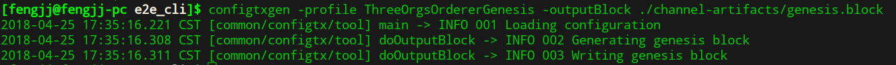

2) 生成channel交易配置文件

使用如下命令，分别对三个channel生成对应配置，并保存在channel-artifacts目录中。

```shell
../../build/bin/configtxgen -profile Orgs1Channel -outputCreateChannelTx ./channel-artifacts/channel1.tx -channelID channel1
../../build/bin/configtxgen -profile Orgs2Channel -outputCreateChannelTx ./channel-artifacts/channel2.tx -channelID channel2
../../build/bin/configtxgen -profile Orgs3Channel -outputCreateChannelTx ./channel-artifacts/channel3.tx -channelID channel3
```

产生如下输出：

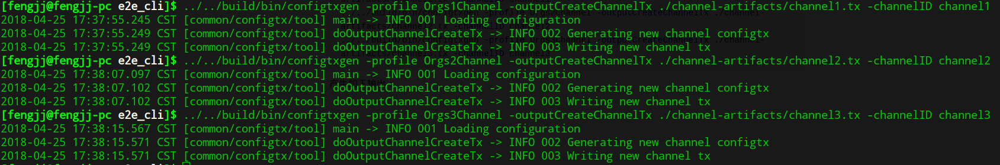3) 生成锚节点交易配置文件

使用如下命令，分别生成三个组织的锚节点配置，保存在channel-artifacts目录中。

```shell
../../build/bin/configtxgen -profile Orgs1Channel -outputAnchorPeersUpdate ./channel-artifacts/Org1MSPanchors.tx -channelID channel1 -asOrg Org1MSP
../../build/bin/configtxgen -profile Orgs2Channel -outputAnchorPeersUpdate ./channel-artifacts/Org2MSPanchors.tx -channelID channel2 -asOrg Org2MSP
../../build/bin/configtxgen -profile Orgs3Channel -outputAnchorPeersUpdate ./channel-artifacts/Org3MSPanchors.tx -channelID channel3 -asOrg Org3MSP
```

4) 检查系统配置

最终产生如下7个配置文件。

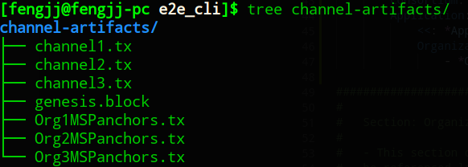

# 4 配置启动节点容器的docker-compose文件

## 4.1 orderer配置

orderer可以直接使用官方案例的默认配置，不需要做太多改动。其配置包括在`base/docker-compose-base.yaml`中。

```yaml
orderer.example.com:
    container_name: orderer.example.com
    image: hyperledger/fabric-orderer
    environment:
      - ORDERER_GENERAL_LOGLEVEL=debug
      - ORDERER_GENERAL_LISTENADDRESS=0.0.0.0
      - ORDERER_GENERAL_GENESISMETHOD=file
      - ORDERER_GENERAL_GENESISFILE=/var/hyperledger/orderer/orderer.genesis.block
      - ORDERER_GENERAL_LOCALMSPID=OrdererMSP
      - ORDERER_GENERAL_LOCALMSPDIR=/var/hyperledger/orderer/msp
      # enabled TLS
      - ORDERER_GENERAL_TLS_ENABLED=true
      - ORDERER_GENERAL_TLS_PRIVATEKEY=/var/hyperledger/orderer/tls/server.key
      - ORDERER_GENERAL_TLS_CERTIFICATE=/var/hyperledger/orderer/tls/server.crt
      - ORDERER_GENERAL_TLS_ROOTCAS=[/var/hyperledger/orderer/tls/ca.crt]
    working_dir: /opt/gopath/src/github.com/hyperledger/fabric
    command: orderer
    volumes:
    - ../channel-artifacts/genesis.block:/var/hyperledger/orderer/orderer.genesis.block
    - ../crypto-config/ordererOrganizations/example.com/orderers/orderer.example.com/msp:/var/hyperledger/orderer/msp
    - ../crypto-config/ordererOrganizations/example.com/orderers/orderer.example.com/tls/:/var/hyperledger/orderer/tls
    #如果order不需要被主机方案，可以改为使用expose语法，只在内部暴露端口
    ports:
      - 7050:7050
```

创世块配置`ORDERER_GENERAL_GENESISFILE=/var/hyperledger/orderer/orderer.genesis.block`，而这个创世块就是之前创建的创世块，使用容器volume，将主机文件映射到容器中，实际生产环境，可以把创世块文件上传到order节点上：

`../channel-artifacts/genesis.block:/var/hyperledger/orderer/orderer.genesis.block`

## 4.2 peer配置

peer的配置从`base/peer-base.yaml`中继承到`base/docker-compose-base.yaml`的配置。

以peer0.org1的配置为例，它在`docker-compose-base.yaml`中：

```yaml
peer0.org1.example.com:
    container_name: peer0.org1.example.com
    extends:
      file: peer-base.yaml
      service: peer-base
    environment:
      - CORE_PEER_ID=peer0.org1.example.com
      - CORE_PEER_ADDRESS=peer0.org1.example.com:7051
      - CORE_PEER_CHAINCODELISTENADDRESS=peer0.org1.example.com:7052
      - CORE_PEER_GOSSIP_EXTERNALENDPOINT=peer0.org1.example.com:7051
      - CORE_PEER_LOCALMSPID=Org1MSP
    volumes:
        - /var/run/:/host/var/run/
        - ../crypto-config/peerOrganizations/org1.example.com/peers/peer0.org1.example.com/msp:/etc/hyperledger/fabric/msp
        - ../crypto-config/peerOrganizations/org1.example.com/peers/peer0.org1.example.com/tls:/etc/hyperledger/fabric/tls
    #社区配置ports来对主机暴露端口，实际测试如果通过cli操作，也可以不对外暴露端口。
    expose:
      - 7051
      - 7052
      - 7053
```

主要使用之前生成的，对peer0.org1的MSP配置和通信用的证书。

## 4.3 cli配置

cli用来访问区块链网络，需要能够访问任意peer和order节点。

```yaml
# Copyright IBM Corp. All Rights Reserved.
#
# SPDX-License-Identifier: Apache-2.0
#

version: '2'

services:

  orderer.example.com:
    extends:
      file:   base/docker-compose-base.yaml
      service: orderer.example.com
    container_name: orderer.example.com

  peer0.org1.example.com:
    container_name: peer0.org1.example.com
    extends:
      file:  base/docker-compose-base.yaml
      service: peer0.org1.example.com

  peer1.org1.example.com:
    container_name: peer1.org1.example.com
    extends:
      file:  base/docker-compose-base.yaml
      service: peer1.org1.example.com

  peer0.org2.example.com:
    container_name: peer0.org2.example.com
    extends:
      file:  base/docker-compose-base.yaml
      service: peer0.org2.example.com

  peer1.org2.example.com:
    container_name: peer1.org2.example.com
    extends:
      file:  base/docker-compose-base.yaml
      service: peer1.org2.example.com
  
  #相对社区版本，增加了一个包含两个peer的组织
  peer0.org3.example.com:
    container_name: peer0.org3.example.com
    extends:
      file: base/docker-compose-base.yaml
      service: peer0.org3.example.com

  peer1.org3.example.com:
    container_name: peer1.org3.example.com
    extends:
      file: base/docker-compose-base.yaml
      service: peer1.org3.example.com

  cli:
    container_name: cli
    image: hyperledger/fabric-tools
    tty: true
    environment:
      - GOPATH=/opt/gopath
      - CORE_VM_ENDPOINT=unix:///host/var/run/docker.sock
      - CORE_LOGGING_LEVEL=DEBUG
      - CORE_PEER_ID=cli
      - CORE_PEER_ADDRESS=peer0.org1.example.com:7051
      - CORE_PEER_LOCALMSPID=Org1MSP
      - CORE_PEER_TLS_ENABLED=true
      - CORE_PEER_TLS_CERT_FILE=/opt/gopath/src/github.com/hyperledger/fabric/peer/crypto/peerOrganizations/org1.example.com/peers/peer0.org1.example.com/tls/server.crt
      - CORE_PEER_TLS_KEY_FILE=/opt/gopath/src/github.com/hyperledger/fabric/peer/crypto/peerOrganizations/org1.example.com/peers/peer0.org1.example.com/tls/server.key
      - CORE_PEER_TLS_ROOTCERT_FILE=/opt/gopath/src/github.com/hyperledger/fabric/peer/crypto/peerOrganizations/org1.example.com/peers/peer0.org1.example.com/tls/ca.crt
      - CORE_PEER_MSPCONFIGPATH=/opt/gopath/src/github.com/hyperledger/fabric/peer/crypto/peerOrganizations/org1.example.com/users/Admin@org1.example.com/msp
    working_dir: /opt/gopath/src/github.com/hyperledger/fabric/peer
    #先注释掉command
    #command: /bin/bash -c './scripts/script.sh ${CHANNEL_NAME}; sleep $TIMEOUT'
    volumes:
        - /var/run/:/host/var/run/
        - ../chaincode/go/:/opt/gopath/src/github.com/hyperledger/fabric/examples/chaincode/go
        - ./crypto-config:/opt/gopath/src/github.com/hyperledger/fabric/peer/crypto/
        - ./scripts:/opt/gopath/src/github.com/hyperledger/fabric/peer/scripts/
        - ./channel-artifacts:/opt/gopath/src/github.com/hyperledger/fabric/peer/channel-artifacts
    depends_on:
      - orderer.example.com
      - peer0.org1.example.com
      - peer1.org1.example.com
      - peer0.org2.example.com
      - peer1.org2.example.com
      - peer0.org3.example.com
      - peer1.org3.example.com
```

相对社区配置，除了增加了一个两peer的组织，也注释掉了command，我们手动来执行channel创建、peer加入等操作。

#5 初始化fabric环境 

##5.1 启动环境

使用docker-compose来启动环境。命令行如下：

`docker-compose -f docker-compose-cli.yaml up -d`

> 使用`-d`参数避免阻塞当前console。

最终产生如下几个容器。

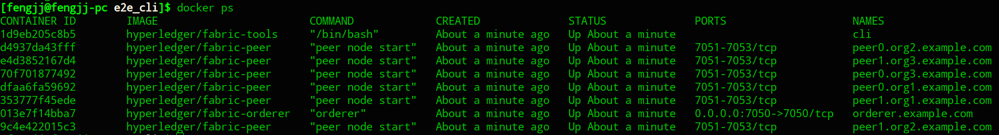

共启动了1个orderer、6个peer、1个cli容器，只有order容器绑定了主机端口，对外提供服务。

## 5.2 创建channel

进入cli容器，以其为客户端，创建channel，并将相应的peer加入到channel中。

`docker exec -it cli bash`

配置`ORDER_CA`后，即可使用系统配置生成的channel交易配置，创建对应的三个channel。

```bash
ORDERER_CA=/opt/gopath/src/github.com/hyperledger/fabric/peer/crypto/ordererOrganizations/example.com/orderers/orderer.example.com/msp/tlscacerts/tlsca.example.com-cert.pem

peer channel create -o orderer.example.com:7050 -c channel1 -f ./channel-artifacts/channel1.tx --tls true --cafile $ORDERER_CA
```

最终在当前目录下产生区块文件`channel1.block`，peer加入channel1需要使用此文件。。

由于cli容器默认环境变量都是只想`org1`的配置，因此如果直接使用类似命令行创建channel2、channel3会导致出现如下错误：

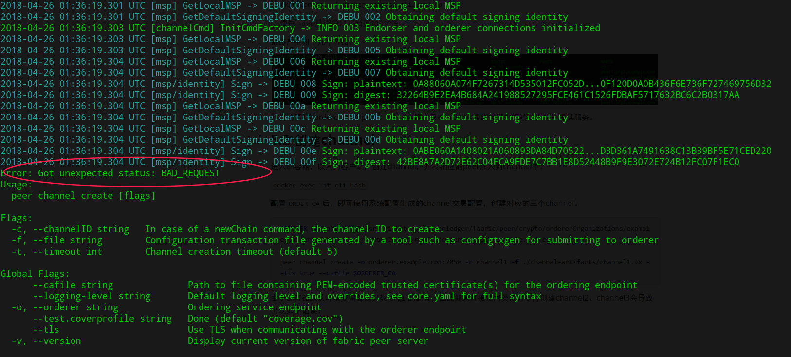

因此需要重新设置相关环境变量，才能创建channel2，如下所示：

```shell
ORDERER_CA=/opt/gopath/src/github.com/hyperledger/fabric/peer/crypto/ordererOrganizations/example.com/orderers/orderer.example.com/msp/tlscacerts/tlsca.example.com-cert.pem
CORE_PEER_TLS_ROOTCERT_FILE=/opt/gopath/src/github.com/hyperledger/fabric/peer/crypto/peerOrganizations/org2.example.com/peers/peer0.org2.example.com/tls/ca.crt
CORE_PEER_TLS_KEY_FILE=/opt/gopath/src/github.com/hyperledger/fabric/peer/crypto/peerOrganizations/org2.example.com/peers/peer0.org2.example.com/tls/server.key
CORE_PEER_LOCALMSPID=Org2MSP
CORE_PEER_TLS_CERT_FILE=/opt/gopath/src/github.com/hyperledger/fabric/peer/crypto/peerOrganizations/org2.example.com/peers/peer0.org2.example.com/tls/server.crt
CORE_PEER_MSPCONFIGPATH=/opt/gopath/src/github.com/hyperledger/fabric/peer/crypto/peerOrganizations/org2.example.com/users/Admin@org2.example.com/msp
CORE_PEER_ID=cli
CORE_LOGGING_LEVEL=DEBUG
CORE_PEER_ADDRESS=peer0.org2.example.com:7051

peer channel create -o orderer.example.com:7050 -c channel2 -f ./channel-artifacts/channel2.tx --tls true --cafile $ORDERER_CA
```

采用相同的方式，创建channel3，执行如下命令：

```bash
ORDERER_CA=/opt/gopath/src/github.com/hyperledger/fabric/peer/crypto/ordererOrganizations/example.com/orderers/orderer.example.com/msp/tlscacerts/tlsca.example.com-cert.pem
CORE_PEER_TLS_ROOTCERT_FILE=/opt/gopath/src/github.com/hyperledger/fabric/peer/crypto/peerOrganizations/org3.example.com/peers/peer0.org3.example.com/tls/ca.crt
CORE_PEER_TLS_KEY_FILE=/opt/gopath/src/github.com/hyperledger/fabric/peer/crypto/peerOrganizations/org3.example.com/peers/peer0.org3.example.com/tls/server.key
CORE_PEER_LOCALMSPID=Org3MSP
CORE_PEER_TLS_CERT_FILE=/opt/gopath/src/github.com/hyperledger/fabric/peer/crypto/peerOrganizations/org3.example.com/peers/peer0.org3.example.com/tls/server.crt
CORE_PEER_MSPCONFIGPATH=/opt/gopath/src/github.com/hyperledger/fabric/peer/crypto/peerOrganizations/org3.example.com/users/Admin@org3.example.com/msp
CORE_PEER_ID=cli
CORE_LOGGING_LEVEL=DEBUG
CORE_PEER_ADDRESS=peer0.org3.example.com:7051

peer channel create -o orderer.example.com:7050 -c channel3 -f ./channel-artifacts/channel3.tx --tls true --cafile $ORDERER_CA
```

最终产生三个channel对应的区块文件。

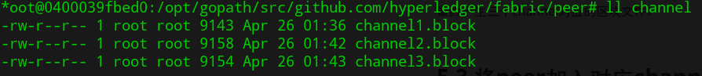

## 5.3 将peer加入对应channel

执行上面的步骤后，环境变量切换到了peer0.org3，因此如果还需要将peer0.org1、peer1.org1的两个节点加入到channel1中需要重新设置环境变量回peer0.org1。

将peer0.org1加入channel1的命令行如下所示：

```bash
ORDERER_CA=/opt/gopath/src/github.com/hyperledger/fabric/peer/crypto/ordererOrganizations/example.com/orderers/orderer.example.com/msp/tlscacerts/tlsca.example.com-cert.pem
CORE_PEER_TLS_ROOTCERT_FILE=/opt/gopath/src/github.com/hyperledger/fabric/peer/crypto/peerOrganizations/org1.example.com/peers/peer0.org1.example.com/tls/ca.crt
CORE_PEER_TLS_KEY_FILE=/opt/gopath/src/github.com/hyperledger/fabric/peer/crypto/peerOrganizations/org1.example.com/peers/peer0.org1.example.com/tls/server.key
CORE_PEER_LOCALMSPID=Org1MSP
CORE_PEER_TLS_CERT_FILE=/opt/gopath/src/github.com/hyperledger/fabric/peer/crypto/peerOrganizations/org1.example.com/peers/peer0.org1.example.com/tls/server.crt
CORE_PEER_MSPCONFIGPATH=/opt/gopath/src/github.com/hyperledger/fabric/peer/crypto/peerOrganizations/org1.example.com/users/Admin@org1.example.com/msp
CORE_PEER_ID=cli
CORE_LOGGING_LEVEL=DEBUG
CORE_PEER_ADDRESS=peer0.org1.example.com:7051

peer channel join -b channel1.block
```

输出类似如下内容，表示加入成功。

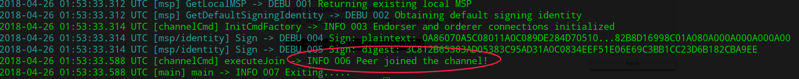

类似地，设置环境变量，将其他5个peer加入到对应channel中。

将peer1.org1加入到channel1的命令行如下所示：

```bash
ORDERER_CA=/opt/gopath/src/github.com/hyperledger/fabric/peer/crypto/ordererOrganizations/example.com/orderers/orderer.example.com/msp/tlscacerts/tlsca.example.com-cert.pem
CORE_PEER_TLS_ROOTCERT_FILE=/opt/gopath/src/github.com/hyperledger/fabric/peer/crypto/peerOrganizations/org1.example.com/peers/peer1.org1.example.com/tls/ca.crt
CORE_PEER_TLS_KEY_FILE=/opt/gopath/src/github.com/hyperledger/fabric/peer/crypto/peerOrganizations/org1.example.com/peers/peer1.org1.example.com/tls/server.key
CORE_PEER_LOCALMSPID=Org1MSP
CORE_PEER_TLS_CERT_FILE=/opt/gopath/src/github.com/hyperledger/fabric/peer/crypto/peerOrganizations/org1.example.com/peers/peer1.org1.example.com/tls/server.crt
CORE_PEER_MSPCONFIGPATH=/opt/gopath/src/github.com/hyperledger/fabric/peer/crypto/peerOrganizations/org1.example.com/users/Admin@org1.example.com/msp
CORE_PEER_ID=cli
CORE_LOGGING_LEVEL=DEBUG
CORE_PEER_ADDRESS=peer1.org1.example.com:7051

peer channel join -b channel1.block
```

将peer0.org2加入到channel2的命令行如下所示：

```bash
ORDERER_CA=/opt/gopath/src/github.com/hyperledger/fabric/peer/crypto/ordererOrganizations/example.com/orderers/orderer.example.com/msp/tlscacerts/tlsca.example.com-cert.pem
CORE_PEER_TLS_ROOTCERT_FILE=/opt/gopath/src/github.com/hyperledger/fabric/peer/crypto/peerOrganizations/org2.example.com/peers/peer0.org2.example.com/tls/ca.crt
CORE_PEER_TLS_KEY_FILE=/opt/gopath/src/github.com/hyperledger/fabric/peer/crypto/peerOrganizations/org2.example.com/peers/peer0.org2.example.com/tls/server.key
CORE_PEER_LOCALMSPID=Org2MSP
CORE_PEER_TLS_CERT_FILE=/opt/gopath/src/github.com/hyperledger/fabric/peer/crypto/peerOrganizations/org2.example.com/peers/peer0.org2.example.com/tls/server.crt
CORE_PEER_MSPCONFIGPATH=/opt/gopath/src/github.com/hyperledger/fabric/peer/crypto/peerOrganizations/org2.example.com/users/Admin@org2.example.com/msp
CORE_PEER_ID=cli
CORE_LOGGING_LEVEL=DEBUG
CORE_PEER_ADDRESS=peer0.org2.example.com:7051

peer channel join -b channel2.block
```

将peer1.org2加入到channel2的命令行如下所示：

```bash
ORDERER_CA=/opt/gopath/src/github.com/hyperledger/fabric/peer/crypto/ordererOrganizations/example.com/orderers/orderer.example.com/msp/tlscacerts/tlsca.example.com-cert.pem
CORE_PEER_TLS_ROOTCERT_FILE=/opt/gopath/src/github.com/hyperledger/fabric/peer/crypto/peerOrganizations/org2.example.com/peers/peer1.org2.example.com/tls/ca.crt
CORE_PEER_TLS_KEY_FILE=/opt/gopath/src/github.com/hyperledger/fabric/peer/crypto/peerOrganizations/org2.example.com/peers/peer1.org2.example.com/tls/server.key
CORE_PEER_LOCALMSPID=Org2MSP
CORE_PEER_TLS_CERT_FILE=/opt/gopath/src/github.com/hyperledger/fabric/peer/crypto/peerOrganizations/org2.example.com/peers/peer1.org2.example.com/tls/server.crt
CORE_PEER_MSPCONFIGPATH=/opt/gopath/src/github.com/hyperledger/fabric/peer/crypto/peerOrganizations/org2.example.com/users/Admin@org2.example.com/msp
CORE_PEER_ID=cli
CORE_LOGGING_LEVEL=DEBUG
CORE_PEER_ADDRESS=peer1.org2.example.com:7051

peer channel join -b channel2.block
```

将peer0.org3加入到channel3的命令如下所示：

```bash
ORDERER_CA=/opt/gopath/src/github.com/hyperledger/fabric/peer/crypto/ordererOrganizations/example.com/orderers/orderer.example.com/msp/tlscacerts/tlsca.example.com-cert.pem
CORE_PEER_TLS_ROOTCERT_FILE=/opt/gopath/src/github.com/hyperledger/fabric/peer/crypto/peerOrganizations/org3.example.com/peers/peer0.org3.example.com/tls/ca.crt
CORE_PEER_TLS_KEY_FILE=/opt/gopath/src/github.com/hyperledger/fabric/peer/crypto/peerOrganizations/org3.example.com/peers/peer0.org3.example.com/tls/server.key
CORE_PEER_LOCALMSPID=Org3MSP
CORE_PEER_TLS_CERT_FILE=/opt/gopath/src/github.com/hyperledger/fabric/peer/crypto/peerOrganizations/org3.example.com/peers/peer0.org3.example.com/tls/server.crt
CORE_PEER_MSPCONFIGPATH=/opt/gopath/src/github.com/hyperledger/fabric/peer/crypto/peerOrganizations/org3.example.com/users/Admin@org3.example.com/msp
CORE_PEER_ID=cli
CORE_LOGGING_LEVEL=DEBUG
CORE_PEER_ADDRESS=peer0.org3.example.com:7051

peer channel join -b channel3.block
```

将peer1.org3加入到channel3的命令如下所示：

```bash
ORDERER_CA=/opt/gopath/src/github.com/hyperledger/fabric/peer/crypto/ordererOrganizations/example.com/orderers/orderer.example.com/msp/tlscacerts/tlsca.example.com-cert.pem
CORE_PEER_TLS_ROOTCERT_FILE=/opt/gopath/src/github.com/hyperledger/fabric/peer/crypto/peerOrganizations/org3.example.com/peers/peer1.org3.example.com/tls/ca.crt
CORE_PEER_TLS_KEY_FILE=/opt/gopath/src/github.com/hyperledger/fabric/peer/crypto/peerOrganizations/org3.example.com/peers/peer0.org3.example.com/tls/server.key
CORE_PEER_LOCALMSPID=Org3MSP
CORE_PEER_TLS_CERT_FILE=/opt/gopath/src/github.com/hyperledger/fabric/peer/crypto/peerOrganizations/org3.example.com/peers/peer1.org3.example.com/tls/server.crt
CORE_PEER_MSPCONFIGPATH=/opt/gopath/src/github.com/hyperledger/fabric/peer/crypto/peerOrganizations/org3.example.com/users/Admin@org3.example.com/msp
CORE_PEER_ID=cli
CORE_LOGGING_LEVEL=DEBUG
CORE_PEER_ADDRESS=peer1.org3.example.com:7051

peer channel join -b channel3.block
```

## 5.4 更新各组织锚节点

> 如果不更新锚节点配置，则默认所有节点可互通?。反正测试时，不创建也可以正常测试chaincode。

更新org1的锚节点配置，使用如下命令行

```bash
ORDERER_CA=/opt/gopath/src/github.com/hyperledger/fabric/peer/crypto/ordererOrganizations/example.com/orderers/orderer.example.com/msp/tlscacerts/tlsca.example.com-cert.pem
CORE_PEER_TLS_ROOTCERT_FILE=/opt/gopath/src/github.com/hyperledger/fabric/peer/crypto/peerOrganizations/org1.example.com/peers/peer0.org1.example.com/tls/ca.crt
CORE_PEER_TLS_KEY_FILE=/opt/gopath/src/github.com/hyperledger/fabric/peer/crypto/peerOrganizations/org1.example.com/peers/peer0.org1.example.com/tls/server.key
CORE_PEER_LOCALMSPID=Org1MSP
CORE_PEER_TLS_CERT_FILE=/opt/gopath/src/github.com/hyperledger/fabric/peer/crypto/peerOrganizations/org1.example.com/peers/peer0.org1.example.com/tls/server.crt
CORE_PEER_MSPCONFIGPATH=/opt/gopath/src/github.com/hyperledger/fabric/peer/crypto/peerOrganizations/org1.example.com/users/Admin@org1.example.com/msp
CORE_PEER_ID=cli
CORE_LOGGING_LEVEL=DEBUG
CORE_PEER_ADDRESS=peer0.org1.example.com:7051

peer channel update -o orderer.example.com:7050 -c channel1 -f ./channel-artifacts/Org1MSPanchors.tx --tls true --cafile $ORDERER_CA
```

更新org2的锚节点配置，使用如下命令行

```bash
ORDERER_CA=/opt/gopath/src/github.com/hyperledger/fabric/peer/crypto/ordererOrganizations/example.com/orderers/orderer.example.com/msp/tlscacerts/tlsca.example.com-cert.pem
CORE_PEER_TLS_ROOTCERT_FILE=/opt/gopath/src/github.com/hyperledger/fabric/peer/crypto/peerOrganizations/org2.example.com/peers/peer0.org2.example.com/tls/ca.crt
CORE_PEER_TLS_KEY_FILE=/opt/gopath/src/github.com/hyperledger/fabric/peer/crypto/peerOrganizations/org2.example.com/peers/peer0.org2.example.com/tls/server.key
CORE_PEER_LOCALMSPID=Org2MSP
CORE_PEER_TLS_CERT_FILE=/opt/gopath/src/github.com/hyperledger/fabric/peer/crypto/peerOrganizations/org2.example.com/peers/peer0.org2.example.com/tls/server.crt
CORE_PEER_MSPCONFIGPATH=/opt/gopath/src/github.com/hyperledger/fabric/peer/crypto/peerOrganizations/org2.example.com/users/Admin@org2.example.com/msp
CORE_PEER_ID=cli
CORE_LOGGING_LEVEL=DEBUG
CORE_PEER_ADDRESS=peer0.org2.example.com:7051

peer channel update -o orderer.example.com:7050 -c channel2 -f ./channel-artifacts/Org2MSPanchors.tx --tls true --cafile $ORDERER_CA
```

更新org3的锚节点配置，使用如下命令行

```bash
ORDERER_CA=/opt/gopath/src/github.com/hyperledger/fabric/peer/crypto/ordererOrganizations/example.com/orderers/orderer.example.com/msp/tlscacerts/tlsca.example.com-cert.pem
CORE_PEER_TLS_ROOTCERT_FILE=/opt/gopath/src/github.com/hyperledger/fabric/peer/crypto/peerOrganizations/org3.example.com/peers/peer0.org3.example.com/tls/ca.crt
CORE_PEER_TLS_KEY_FILE=/opt/gopath/src/github.com/hyperledger/fabric/peer/crypto/peerOrganizations/org3.example.com/peers/peer0.org3.example.com/tls/server.key
CORE_PEER_LOCALMSPID=Org3MSP
CORE_PEER_TLS_CERT_FILE=/opt/gopath/src/github.com/hyperledger/fabric/peer/crypto/peerOrganizations/org3.example.com/peers/peer0.org3.example.com/tls/server.crt
CORE_PEER_MSPCONFIGPATH=/opt/gopath/src/github.com/hyperledger/fabric/peer/crypto/peerOrganizations/org3.example.com/users/Admin@org3.example.com/msp
CORE_PEER_ID=cli
CORE_LOGGING_LEVEL=DEBUG
CORE_PEER_ADDRESS=peer0.org3.example.com:7051

peer channel update -o orderer.example.com:7050 -c channel3 -f ./channel-artifacts/Org3MSPanchors.tx --tls true --cafile $ORDERER_CA
```

# 6 安装chaincode并运行

执行完上述步骤后，我们就可以验证chaincode和多channel的私密性了。

##6.1 部署chaincode

在cli容器中，继续执行命令行，在peer0.org1上安装chaincode，命令行如下所示。

```bash
ORDERER_CA=/opt/gopath/src/github.com/hyperledger/fabric/peer/crypto/ordererOrganizations/example.com/orderers/orderer.example.com/msp/tlscacerts/tlsca.example.com-cert.pem
CORE_PEER_TLS_ROOTCERT_FILE=/opt/gopath/src/github.com/hyperledger/fabric/peer/crypto/peerOrganizations/org1.example.com/peers/peer0.org1.example.com/tls/ca.crt
CORE_PEER_TLS_KEY_FILE=/opt/gopath/src/github.com/hyperledger/fabric/peer/crypto/peerOrganizations/org1.example.com/peers/peer0.org1.example.com/tls/server.key
CORE_PEER_LOCALMSPID=Org1MSP
CORE_PEER_TLS_CERT_FILE=/opt/gopath/src/github.com/hyperledger/fabric/peer/crypto/peerOrganizations/org1.example.com/peers/peer0.org1.example.com/tls/server.crt
CORE_PEER_MSPCONFIGPATH=/opt/gopath/src/github.com/hyperledger/fabric/peer/crypto/peerOrganizations/org1.example.com/users/Admin@org1.example.com/msp
CORE_PEER_ID=cli
CORE_LOGGING_LEVEL=DEBUG
CORE_PEER_ADDRESS=peer0.org1.example.com:7051

peer chaincode install -n mycc -v 1.0 -p github.com/hyperledger/fabric/examples/chaincode/go/chaincode_example02
```

安装过程实际上就是根据`GOPATH`下指定代码进行打包，然后通过同一主机上共享的挂载卷，将chaincode发送到peer0.org1上，但不实际启动容器运行chaincode。

## 6.2 实例化chaincode

继续执行，在peer0.org1上实例化chaincode，命令行如下所示：

`peer chaincode instantiate -o orderer.example.com:7050 --tls true --cafile $ORDERER_CA -C channel1 -n mycc -v 1.0 -c '{"Args":["init","a","100","b","200"]}'`

> 初始化可以执行几次？

另起一个终端，监听peer0.org1的容器，可见peer0.org1使用Dockerfile编译新的容器镜像，将chaincode打包在镜像中，然后启动chaincode容器，以供调用。关键日志如下：

构建chaincode镜像并启动容器

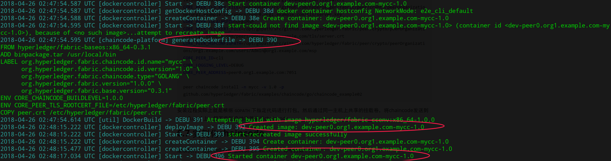

完成背书

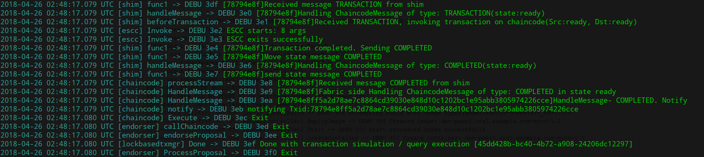

完成验证

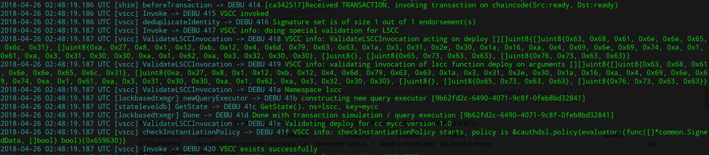

保存数据到文件系统上的区块链、statedb、historydb

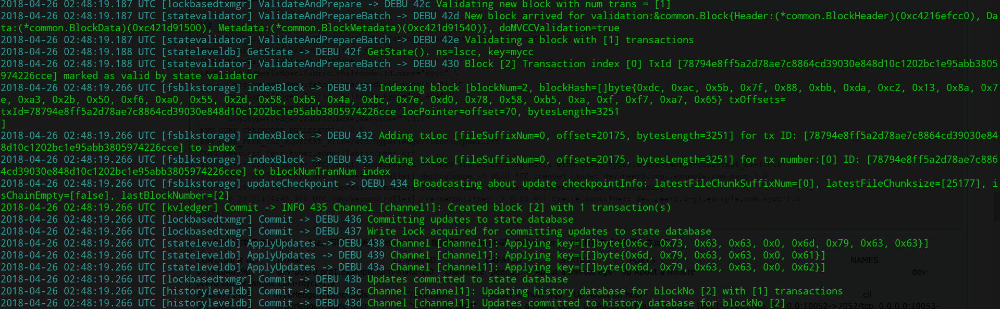

发消息通知交易完成

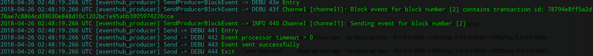

##6.3 测试交易过程

实例化时，a账户100，b账户200。查询账户信息。

在cli容器中，保持peer0.org1的环境变量配置，查询a账户信息，可见输出`Query Result: 100`，可以正常查询。

`peer chaincode query -C channel1 -n mycc -c '{"Args":["query","a"]}'`

从b账户转给a账户100，再查询a账户数据。

```
peer chaincode invoke -o orderer.example.com:7050  --tls true --cafile $ORDERER_CA -C channel1 -n mycc -c '{"Args":["invoke","b","a","100"]}'
```

再分别查询a、b账户数据，可见交易成功。

```
peer chaincode query -C channel1 -n mycc -c '{"Args":["query","a"]}'
peer chaincode query -C channel1 -n mycc -c '{"Args":["query","b"]}'
```

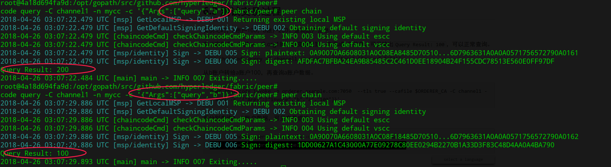

## 6.4 在peer1.org1上部署chaincode

在cli容器中，设置环境变量为peer1.org1，并部署chaincode。如下所示：

```bash
ORDERER_CA=/opt/gopath/src/github.com/hyperledger/fabric/peer/crypto/ordererOrganizations/example.com/orderers/orderer.example.com/msp/tlscacerts/tlsca.example.com-cert.pem
CORE_PEER_TLS_ROOTCERT_FILE=/opt/gopath/src/github.com/hyperledger/fabric/peer/crypto/peerOrganizations/org1.example.com/peers/peer1.org1.example.com/tls/ca.crt
CORE_PEER_TLS_KEY_FILE=/opt/gopath/src/github.com/hyperledger/fabric/peer/crypto/peerOrganizations/org1.example.com/peers/peer1.org1.example.com/tls/server.key
CORE_PEER_LOCALMSPID=Org1MSP
CORE_PEER_TLS_CERT_FILE=/opt/gopath/src/github.com/hyperledger/fabric/peer/crypto/peerOrganizations/org1.example.com/peers/peer1.org1.example.com/tls/server.crt
CORE_PEER_MSPCONFIGPATH=/opt/gopath/src/github.com/hyperledger/fabric/peer/crypto/peerOrganizations/org1.example.com/users/Admin@org1.example.com/msp
CORE_PEER_ID=cli
CORE_LOGGING_LEVEL=DEBUG
CORE_PEER_ADDRESS=peer1.org1.example.com:7051

peer chaincode install -n mycc -v 1.0 -p github.com/hyperledger/fabric/examples/chaincode/go/chaincode_example02
```

此时，peer1.org1不会启动chaincode容器。当执行查询时

`peer chaincode query -C channel1 -n mycc -c '{"Args":["query","a"]}'`

由于peer1.org1并未启动chaincode容器，需要重新进行一遍编译镜像、启动容器等等过程来执行查询，因此需要等待较长的一段时间（10秒以上）。

## 6.5 在其他channel的peer上安装并测试chaincode

参考6.3、6.4步骤，可以在channel2、channel3

在channel2的peer0\.org2上安装并测试chaincode。

```
ORDERER_CA=/opt/gopath/src/github.com/hyperledger/fabric/peer/crypto/ordererOrganizations/example.com/orderers/orderer.example.com/msp/tlscacerts/tlsca.example.com-cert.pem
CORE_PEER_TLS_ROOTCERT_FILE=/opt/gopath/src/github.com/hyperledger/fabric/peer/crypto/peerOrganizations/org2.example.com/peers/peer0.org2.example.com/tls/ca.crt
CORE_PEER_TLS_KEY_FILE=/opt/gopath/src/github.com/hyperledger/fabric/peer/crypto/peerOrganizations/org2.example.com/peers/peer0.org2.example.com/tls/server.key
CORE_PEER_LOCALMSPID=Org2MSP
CORE_PEER_TLS_CERT_FILE=/opt/gopath/src/github.com/hyperledger/fabric/peer/crypto/peerOrganizations/org2.example.com/peers/peer0.org2.example.com/tls/server.crt
CORE_PEER_MSPCONFIGPATH=/opt/gopath/src/github.com/hyperledger/fabric/peer/crypto/peerOrganizations/org2.example.com/users/Admin@org2.example.com/msp
CORE_PEER_ID=cli
CORE_LOGGING_LEVEL=DEBUG
CORE_PEER_ADDRESS=peer0.org2.example.com:7051

peer chaincode install -n mycc -v 1.0 -p github.com/hyperledger/fabric/examples/chaincode/go/chaincode_example02

peer chaincode instantiate -o orderer.example.com:7050 --tls true --cafile $ORDERER_CA -C channel2 -n mycc -v 1.0 -c '{"Args":["init","a","100","b","200"]}'

peer chaincode query -C channel2 -n mycc -c '{"Args":["query","a"]}'
```

可见输出`Query Result: 100`，与channel1的数据互不干扰。

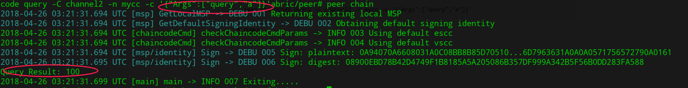


# 7 总结

现在只是对社区示例的简单修改，将org、channel、peer、chaincode的操作步骤拆分开来，帮助理解。真实环境中，完全可以参考此案例进行操作，创建更多的org和channel。